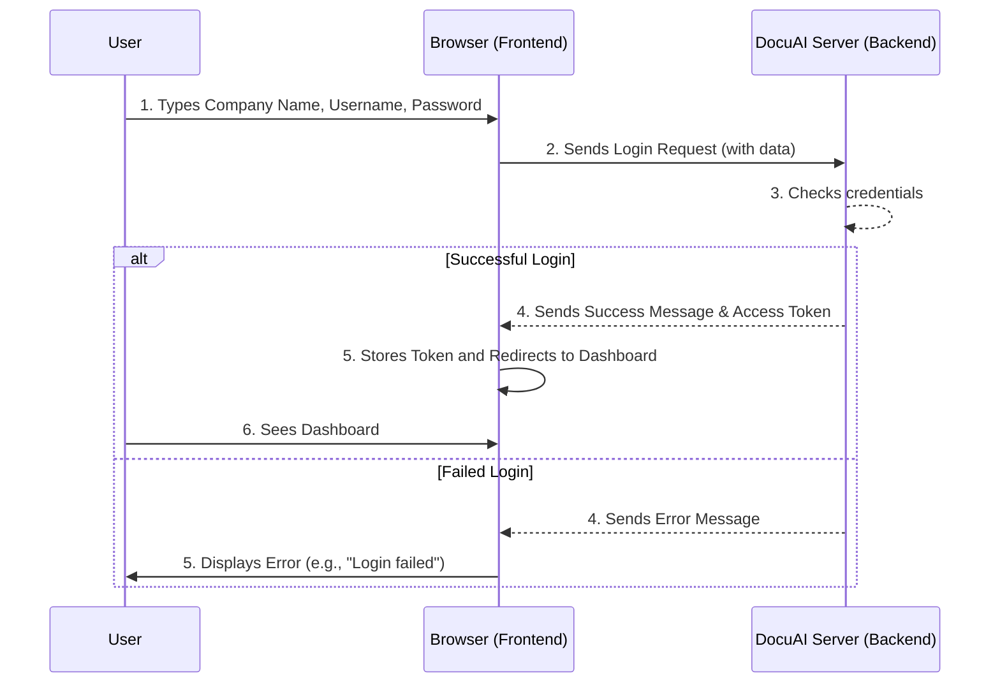

# Chapter 1: Frontend User Interface

Imagine you're using your favorite app or website. What's the first thing you notice? The buttons, the text, the images, the menus – everything you see and interact with! This "face" of the application is what we call the **Frontend User Interface (UI)**. For our DocuAI Navigator project, the Frontend UI is like the control panel and display screen that makes a powerful, complex system easy and friendly for you to use.

## Why Do We Need a Frontend?

Think of it this way: DocuAI Navigator has a brain (the AI and all its complex logic) and a memory (where it stores your documents and data). But how do *you* talk to it? You don't want to type complicated code commands every time you want to upload a document or ask a question.

That's where the Frontend UI comes in! It solves this problem by:

1.  **Making it Visual**: Presenting information, documents, and chat responses in a way you can easily understand.
2.  **Making it Interactive**: Allowing you to click buttons, type in forms, and control the system with simple actions.
3.  **Hiding Complexity**: You don't need to know *how* the AI works; you just need to know *how to use it*.

Our main goal in this chapter is to understand how the Frontend UI lets you **log in to DocuAI Navigator and view your personalized dashboard**.

## The Three Pillars of the Web Frontend

Every webpage you visit, including DocuAI Navigator, is built using three fundamental technologies:

| Technology | Analogy            | What it Does                                       | Example Role in DocuAI                                  |
| :--------- | :----------------- | :------------------------------------------------- | :-------------------------------------------------------- |
| **HTML**   | The "Bones"        | Defines the *structure* and *content* of the page. | Creates the login form, dashboard layout, buttons, text.  |
| **CSS**    | The "Skin"         | Controls the *look* and *style* of the page.       | Sets colors, fonts, spacing, makes buttons look nice.     |
| **JavaScript** | The "Brains"       | Adds *interactivity* and *dynamic behavior*.       | Handles login button clicks, sends data to the server, displays messages. |

Together, these three create the experience you see in your web browser.

## The First Step: Logging In

Let's look at how these three pieces work together to create the login page for DocuAI Navigator.

### 1. HTML: Structuring the Login Page

The `index.html` file is where we define the elements for our login and registration forms. It's the skeleton of the page.

```html
<!-- frontend/index.html - Simplified login form -->
<!DOCTYPE html>
<html lang="en">
<head>
  <meta charset="UTF-8" />
  <title>DocuAI Navigator - Login/Register</title>
  <!-- Link to our styling -->
  <link href="https://fonts.googleapis.com/css2?family=Poppins...display=swap" rel="stylesheet">
  <!-- Styles go here or in a separate CSS file -->
  <style> /* ... CSS code will go here ... */ </style>
</head>
<body>
  <div class="container">
    <div class="right">
      <div class="tabs">
        <div class="tab active" id="loginTab">Login</div>
        <div class="tab" id="registerTab">Register</div>
      </div>
      <!-- This is our login form -->
      <form id="loginForm" class="active">
        <input type="text" id="loginCompanyName" placeholder="Company Name" required />
        <input type="text" id="loginUsername" placeholder="Username" required />
        <input type="password" id="loginPassword" placeholder="Password" required />
        <button type="submit">Login</button>
      </form>
      <!-- Registration form is similar, but hidden by default -->
      <form id="registerForm">
        <!-- ... registration fields ... -->
      </form>
    </div>
  </div>
  <!-- Our JavaScript code will go here -->
  <script> /* ... JS code will go here ... */ </script>
</body>
</html>
```

*   **`<!DOCTYPE html>`**: Tells the browser this is an HTML5 document.
*   **`<html lang="en">`**: The root of the page, defining the language.
*   **`<head>`**: Contains information about the page (title, links to styles).
*   **`<body>`**: Contains everything you see on the page.
*   **`<div>`**: A general container for grouping other elements.
*   **`<form>`**: Defines an HTML form for user input.
*   **`<input>`**: A field where the user can type text or a password.
*   **`<button>`**: A clickable button.
*   **`id` and `class`**: These are labels that CSS uses to style elements and JavaScript uses to find and interact with them.

### 2. CSS: Styling the Login Page

CSS (`<style>` tags or `.css` files) makes the raw HTML look good. It defines colors, fonts, layout, and how elements respond to your mouse.

```css
/* frontend/index.html - Simplified CSS for a button */
<style>
  /* General body styles */
  body {
    margin: 0;
    font-family: 'Poppins', sans-serif;
    background-color: #f8fafc;
    display: flex;
    height: 100vh;
    justify-content: center;
    align-items: center;
  }
  /* Styles for the login button */
  button {
    background: #4a69e2; /* Our primary color */
    color: #ffffff; /* White text */
    border: none;
    padding: 14px 20px;
    font-size: 16px;
    font-weight: 600;
    border-radius: 8px; /* Slightly rounded corners */
    cursor: pointer; /* Shows a hand cursor on hover */
    transition: all 0.3s ease; /* Smooth animation for changes */
  }
  button:hover {
    background: #3b55b5; /* Darker blue on hover */
    transform: translateY(-2px); /* Slightly lift the button */
  }
</style>
```

*   **`body { ... }`**: Styles applied to the entire page.
*   **`button { ... }`**: Styles applied specifically to all `<button>` elements.
*   **`background`, `color`, `padding`, `border-radius`, `font-size`**: Common CSS properties to control appearance.
*   **`button:hover`**: A special CSS rule that applies styles only when the mouse cursor is over the button.

### 3. JavaScript: Making it Interactive

JavaScript brings the page to life. It handles what happens when you click, type, or interact with the page. For our login, it listens for the "submit" event on the form and then sends your data to the backend.

```javascript
// frontend/index.html - Simplified JavaScript for login
<script>
  const API_BASE = "http://127.0.0.1:8000"; // The address of our backend server

  // Get a reference to the login form
  const loginForm = document.getElementById("loginForm");

  // Listen for when the login form is submitted
  loginForm.addEventListener("submit", async (e) => {
    e.preventDefault(); // Stop the browser from doing its default form submission

    // Get the values typed by the user
    const company_name = document.getElementById("loginCompanyName").value;
    const username = document.getElementById("loginUsername").value;
    const password = document.getElementById("loginPassword").value;

    // Send this data to our backend server
    const res = await fetch(`${API_BASE}/company/login`, {
      method: "POST", // This means we are sending data
      headers: { "Content-Type": "application/json" }, // We're sending JSON data
      body: JSON.stringify({ company_name, username, password }), // Our data in JSON format
    });

    // Check if the login was successful
    if (res.ok) {
      const data = await res.json();
      localStorage.setItem("token", data.access_token); // Store a special key (token)
      window.location.href = "dashboard.html"; // Go to the dashboard page!
    } else {
      const err = await res.json();
      alert("❌ Login failed: " + err.detail); // Show an error message
    }
  });
</script>
```

*   **`const API_BASE = "..."`**: Defines the address of our server, where the backend logic runs.
*   **`document.getElementById(...)`**: This JavaScript command helps us find specific HTML elements using their `id`.
*   **`addEventListener("submit", ...)`**: This makes the form "listen" for a `submit` event (when you click the login button or press Enter).
*   **`e.preventDefault()`**: Stops the browser from reloading the page, so our JavaScript can handle the submission.
*   **`fetch(...)`**: This is how JavaScript sends requests to a server (our backend). It's like sending a letter.
    *   **`method: "POST"`**: Indicates we are sending new data to the server.
    *   **`headers`**: Provides extra information about our request, like the type of data we're sending.
    *   **`body`**: Contains the actual data we want to send (your company name, username, and password).
*   **`res.ok`**: Checks if the server responded successfully.
*   **`localStorage.setItem("token", ...)`**: If login is successful, we store a `token` (a small piece of data that proves you're logged in) in the browser's local storage so you don't have to log in again immediately.
*   **`window.location.href = "dashboard.html"`**: This command tells the browser to go to a new page, which is our dashboard!

## After Login: The Dashboard

Once you've successfully logged in, the Frontend UI takes you to your `dashboard.html`. This page is also built with HTML, CSS, and JavaScript. It's designed to *display* important information from the backend and *allow you to trigger further actions*.

Here's a snippet of the `dashboard.html` to show how it displays company information:

```html
<!-- frontend/dashboard.html - Simplified display of company data -->
<body>
  <div class="sidebar">
    <div class="sidebar-header">DocuAI Navigator</div>
    <!-- ... sidebar navigation links ... -->
    <div class="sidebar-footer">
      <button id="logoutBtn">🚪 <span>Logout Company</span></button>
    </div>
  </div>

  <div class="main">
    <div class="header" id="companyHeader">Welcome</div>
    <div class="content">
      <div class="cards">
        <div class="card">
          <h3>Teams</h3>
          <p id="teamCount">0</p> <!-- This number will be filled by JS -->
        </div>
        <div class="card">
          <h3>Projects</h3>
          <p id="projectCount">0</p> <!-- This number will be filled by JS -->
        </div>
      </div>
      <div class="docs-container">
        <h3>📑 Company Documents</h3>
        <ul id="docsList">
          <li>Loading...</li> <!-- This list will be filled by JS -->
        </ul>
      </div>
    </div>
  </div>
  <script>
    // ... JavaScript to fetch data and update the elements above ...
    async function loadDashboard() {
      // ... fetch company details from backend using the 'token' ...
      // ... assume 'data' contains company_name, no_of_teams, no_of_projects, company_files_name ...

      document.getElementById("companyHeader").textContent = `Welcome, ${data.company_name}`;
      document.getElementById("teamCount").textContent = data.no_of_teams ?? 0;
      document.getElementById("projectCount").textContent = data.no_of_projects ?? 0;
      
      const docsList = document.getElementById("docsList");
      docsList.innerHTML = ""; // Clear "Loading..."
      if (Array.isArray(data.company_files_name) && data.company_files_name.length > 0) {
        data.company_files_name.forEach(doc => {
          const li = document.createElement("li");
          li.textContent = `${doc.pdf_name} (${doc.filename})`;
          docsList.appendChild(li);
        });
      } else {
        docsList.innerHTML = "<li>No documents uploaded yet</li>";
      }
    }
    loadDashboard(); // Call this function when the page loads
  </script>
</body>
```

Here, JavaScript fetches data from the backend about the logged-in company (like its name, number of teams, projects, and uploaded documents). Then, it dynamically updates the `textContent` of elements like `companyHeader`, `teamCount`, `projectCount`, and `docsList` to display this information to you.

## How It Works: Under the Hood

Let's visualize the login process with a simple diagram.



1.  **User Input**: You type your login details into the forms on `index.html`.
2.  **Frontend Sends Request**: When you click "Login," the JavaScript in `index.html` gathers your input and uses `fetch` to send it as a "login request" to the DocuAI Server (our backend).
3.  **Backend Verification**: The DocuAI Server receives this request. It then checks if the company name, username, and password match what it has stored. (More on how the backend handles this in [API Endpoints & Routing](02_api_endpoints___routing_.md) and [Data Modeling & Validation](03_data_modeling___validation_.md)).
4.  **Backend Response**:
    *   If the login is successful, the backend sends back a success message and a special `access_token`. This token is like a temporary ID card that tells the backend you're authenticated for future requests.
    *   If the login fails, the backend sends back an error message.
5.  **Frontend Handles Response**:
    *   If successful, the JavaScript stores the `access_token` and then automatically navigates your browser to `dashboard.html`.
    *   If it fails, it displays an alert with the error message.
6.  **Dashboard Display**: On `dashboard.html`, JavaScript immediately uses your stored `access_token` to ask the backend for your company's specific data (number of teams, projects, documents). It then updates the HTML elements to show this information.

Other pages like `company.html`, `team_dashboard.html`, and `project_dashboard.html` also use this same principle: HTML for structure, CSS for looks, and JavaScript to send requests (e.g., uploading a document, chatting with AI) to the backend and display the responses.

## Conclusion

The Frontend User Interface is your window into the DocuAI Navigator system. It's built with HTML for structure, CSS for style, and JavaScript for all the interactive magic. It takes complex operations like logging in, uploading documents, and chatting with AI, and presents them in a way that's intuitive and easy to use. Without the Frontend, interacting with a powerful AI system would be incredibly difficult!

Next, we'll dive into the secret language the Frontend uses to talk to the Backend: [API Endpoints & Routing](02_api_endpoints___routing_.md).

---

<sub><sup>Generated by [AI Codebase Knowledge Builder](https://github.com/The-Pocket/Tutorial-Codebase-Knowledge).</sup></sub> <sub><sup>**References**: [[1]](https://github.com/aniq63/Docu-AI-Navigator/blob/88058617d37a22d266628a39e74c24e1f503a0a5/frontend/about.html), [[2]](https://github.com/aniq63/Docu-AI-Navigator/blob/88058617d37a22d266628a39e74c24e1f503a0a5/frontend/company.html), [[3]](https://github.com/aniq63/Docu-AI-Navigator/blob/88058617d37a22d266628a39e74c24e1f503a0a5/frontend/dashboard.html), [[4]](https://github.com/aniq63/Docu-AI-Navigator/blob/88058617d37a22d266628a39e74c24e1f503a0a5/frontend/index.html), [[5]](https://github.com/aniq63/Docu-AI-Navigator/blob/88058617d37a22d266628a39e74c24e1f503a0a5/frontend/plan_view.html), [[6]](https://github.com/aniq63/Docu-AI-Navigator/blob/88058617d37a22d266628a39e74c24e1f503a0a5/frontend/project.html), [[7]](https://github.com/aniq63/Docu-AI-Navigator/blob/88058617d37a22d266628a39e74c24e1f503a0a5/frontend/project_dashboard.html), [[8]](https://github.com/aniq63/Docu-AI-Navigator/blob/88058617d37a22d266628a39e74c24e1f503a0a5/frontend/team.html), [[9]](https://github.com/aniq63/Docu-AI-Navigator/blob/88058617d37a22d266628a39e74c24e1f503a0a5/frontend/team_dashboard.html)</sup></sub>
