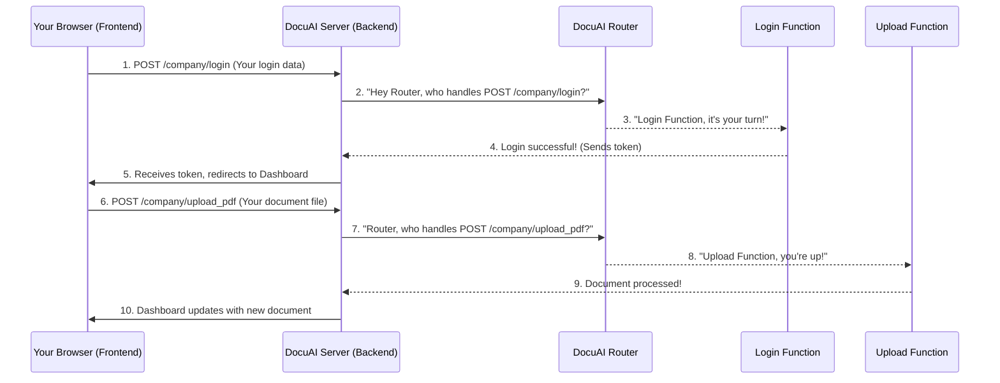

# Chapter 2: API Endpoints & Routing

In the previous chapter, [Frontend User Interface](01_frontend_user_interface_.md), we learned about the "face" of our DocuAI Navigator – everything you see and interact with in your web browser. We saw how clicking a "Login" button triggers JavaScript to send your username and password. But where does that information go? And how does the server know what to do with it?

This is where **API Endpoints & Routing** come in!

## What Problem Do They Solve?

Imagine you want to order food. You don't just yell your order into the street. You call a specific restaurant (like "Pizza Place"), and then you talk to someone specific (like "Order Taker") and tell them what you want.

In our DocuAI Navigator, your web browser (the frontend) is like you, and the DocuAI Server (the backend) is like the restaurant.

*   **API Endpoints** are like the *specific phone numbers* or *addresses* for different services the server offers. Do you want to "register a company"? Call `/company/register`. Do you want to "upload a document"? Call `/company/upload_pdf`.
*   **Routing** is like the *operator* or *GPS system* at the restaurant. When your call comes in, the operator listens to which number you called and directs your request to the right person or department to handle it (e.g., the "Order Taker" for food orders, or "Customer Service" for complaints).

Together, they create a structured way for your browser and the server to communicate efficiently. This ensures that when you click a button or type something on the frontend, the backend server knows *exactly* which action you want to perform and where to send your request.

## Key Concepts: Endpoints & Routing

Let's break down these two ideas:

### 1. API Endpoints: The Server's Addresses

An API Endpoint is a specific URL on the server that performs a particular task. It usually combines:

*   **Base URL**: The main address of your server (e.g., `http://127.0.0.1:8000`).
*   **Path**: A specific part of the address that tells the server *what* you want to do (e.g., `/company/login` or `/company/upload_pdf`).
*   **HTTP Method**: This tells the server *how* you want to interact with that path.

Think of HTTP Methods as different ways you can interact with a restaurant:

| HTTP Method | Analogy               | What it Does for DocuAI Navigator         | Example                                 |
| :---------- | :-------------------- | :---------------------------------------- | :---------------------------------------- |
| **GET**     | Look at the menu      | Request information from the server.      | Get your company's dashboard data.        |
| **POST**    | Place an order        | Send new data to the server to create something or perform an action. | Log in, register a company, upload a document. |
| **PUT/PATCH** | Change an existing order | Update existing data on the server.       | (Less used in our basic examples)         |
| **DELETE**  | Cancel an order       | Remove data from the server.              | (Less used in our basic examples)         |

So, when you submit the login form, your browser performs a `POST` request to the `/company/login` endpoint.

### 2. Routing: Directing the Traffic

Routing is the process on the server side that takes an incoming request (like a `POST` request to `/company/login`) and directs it to the correct piece of code designed to handle that specific request.

Our DocuAI Navigator backend uses a tool called **FastAPI** which makes routing super easy. You simply define a function and then tell FastAPI which endpoint and method should trigger that function.

## Our Use Case: Logging In & Uploading a Document

Let's revisit the login process from Chapter 1 and extend it to uploading a document.

When you interact with the frontend:

1.  **Logging In**: You type your details and click "Login".
2.  **Uploading a Document**: On the dashboard, you select a file and click "Upload".

Here's how API Endpoints and Routing make these actions possible:



## How It Works: Under the Hood

Our backend uses **FastAPI** to set up these endpoints and handle routing. Think of FastAPI as the server's control tower, ensuring every incoming request lands on the right runway.

### 1. The Main App and Routers (`main.py`)

The very first step is for our main application to know about all the different "sections" of our API. We organize our endpoints into different files called "routers" (like `company.py`, `team.py`, `project.py`).

```python
# main.py
from fastapi import FastAPI
from Routers.company import router as company_router
from Routers.team import router as team_router
from Routers.project import router as project_router
# ... other imports ...

app = FastAPI(title="Document Intelligent System for Companies")

# Tell the main app to include these routers
app.include_router(company_router)
app.include_router(team_router)
app.include_router(project_router)

# ... other configurations like CORS and static files ...
```

*   `from Routers.company import router as company_router`: This line imports a special object named `router` from our `Routers/company.py` file. We give it a shorter name, `company_router`, for convenience.
*   `app.include_router(company_router)`: This tells our main FastAPI application to **include all the endpoints defined in the `company_router`**. So, all endpoints like `/company/login` or `/company/register` become part of our main application.

### 2. Defining Endpoints in a Router (`Routers/company.py`)

Now, let's look inside `Routers/company.py` to see how specific endpoints are defined.

**Login Endpoint:**

```python
# Routers/company.py - Simplified login endpoint
from fastapi import APIRouter, HTTPException, Header, Depends, Request
from sqlalchemy import and_
import models, schemas
from database import SessionLocal # For database interaction

router = APIRouter(
    prefix="/company", # All endpoints in this router will start with /company
    tags=["Company Management"]
)

# ... get_db dependency function (helps manage database connections) ...

@router.post("/login", response_model=schemas.TokenResponse)
async def company_login(request: Request, db: Session = Depends(get_db)):
    """
    Handles login requests for companies.
    It expects username, company_name, and password.
    """
    try:
        payload = await request.json() # Get login details from the request
        form_obj = schemas.LoginRequest(**payload) # Check if data is valid
    except Exception as e:
        raise HTTPException(status_code=400, detail=f"Invalid input: {str(e)}")

    user = db.query(models.Company).filter(
        and_(
            models.Company.username == form_obj.username,
            models.Company.company_name == form_obj.company_name
        )
    ).first()

    if not user or user.password != form_obj.password:
        raise HTTPException(status_code=401, detail="Incorrect username, company name, or password")

    # ... Generate and store a session token ...
    # This token is sent back to the frontend to keep the user logged in.

    return {"access_token": token, "token_type": "simple"}
```

*   `router = APIRouter(prefix="/company", ...)`: This creates our "operator" for company-related tasks. The `prefix="/company"` means any endpoint defined here will automatically start with `/company/`.
*   `@router.post("/login", ...)`: This is the magic part!
    *   `@router.post`: This tells FastAPI that this function should handle `POST` requests.
    *   `("/login")`: This specifies the *path* for this endpoint. Since our router has a prefix of `/company`, the full path becomes `/company/login`.
    *   `async def company_login(...)`: This is the actual Python function that gets called when a `POST` request arrives at `/company/login`. It contains all the logic for checking the username and password.

**Upload PDF Endpoint:**

Similarly, for uploading a document:

```python
# Routers/company.py - Simplified upload endpoint
# ... (imports and router definition as above) ...

@router.post("/upload_pdf", response_model=schemas.CompanyOut)
async def upload_pdf(
    file: UploadFile = File(...), # Expects a file to be uploaded
    current_user: models.Company = Depends(get_current_user), # Ensures user is logged in
    db: Session = Depends(get_db) # For database interaction
):
    """
    Handles uploading PDF documents for a logged-in company.
    """
    try:
        # 1. Save the uploaded file to a special folder on the server
        # (e.g., in 'uploads/company_123/your_document.pdf')
        # ... file saving logic ...

        # 2. Process the document (e.g., extract text, create embeddings)
        documents = document_validator(saved_path)
        extracted_name = extract_name_from_pdf(documents)
        
        # 3. Add document info to our special search database (vectorstore)
        parent_id = add_documents_to_collection(str(current_user.id), documents, file_name=unique_filename)

        # 4. Update the company's record in the database with the new document's details
        new_file_info = { "pdf_name": extracted_name, "filename": unique_filename, "parent_id": parent_id }
        current_user.company_files_name.append(new_file_info)

        db.commit() # Save changes to the database
        db.refresh(current_user) # Get the latest data for the company

        return current_user # Send updated company info back to the frontend

    except Exception as e:
        raise HTTPException(status_code=500, detail=str(e))
```

*   `@router.post("/upload_pdf", ...)`: This defines the endpoint for uploading PDFs. It expects a `POST` request to `/company/upload_pdf`.
*   `file: UploadFile = File(...)`: This tells FastAPI to expect an uploaded file, not just text data.
*   `current_user: models.Company = Depends(get_current_user)`: This is a special feature. Before `upload_pdf` even runs, FastAPI will first call `get_current_user` to check if the user is logged in using their `X-Token` (the token from login). If not, the request stops with an error. This is how we protect our endpoints!
*   The `upload_pdf` function then contains the logic to save the file, process it, and update the company's information in the database.

## Conclusion

API Endpoints and Routing are the backbone of how your frontend and backend communicate. They provide a clear, structured "menu" of services the server offers (endpoints) and a smart "operator" to direct your requests to the right place (routing). Whether you're logging in or uploading a document, these mechanisms ensure your actions are understood and handled correctly by the DocuAI Navigator server.

Now that we understand how requests are sent and received, our next step is to explore how the server *understands* and *validates* the data you send. We'll dive into [Data Modeling & Validation](03_data_modeling___validation_.md).

---

<sub><sup>Generated by [AI Codebase Knowledge Builder](https://github.com/The-Pocket/Tutorial-Codebase-Knowledge).</sup></sub> <sub><sup>**References**: [[1]](https://github.com/aniq63/Docu-AI-Navigator/blob/88058617d37a22d266628a39e74c24e1f503a0a5/Routers/company.py), [[2]](https://github.com/aniq63/Docu-AI-Navigator/blob/88058617d37a22d266628a39e74c24e1f503a0a5/Routers/project.py), [[3]](https://github.com/aniq63/Docu-AI-Navigator/blob/88058617d37a22d266628a39e74c24e1f503a0a5/Routers/team.py), [[4]](https://github.com/aniq63/Docu-AI-Navigator/blob/88058617d37a22d266628a39e74c24e1f503a0a5/main.py)</sup></sub>
