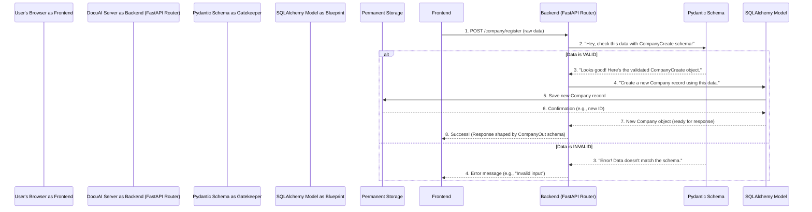

# Chapter 3: Data Modeling & Validation

In the last chapter, [API Endpoints & Routing](02_api_endpoints___routing_.md), we learned how your web browser (the frontend) sends requests to specific "addresses" (API Endpoints) on our DocuAI server (the backend). We saw how the server uses "routing" to direct these requests to the right piece of code.

But once the server receives a request, like a new user trying to register their company, how does it know:
1.  **What kind of information to expect?** (e.g., username, company name, password, email)
2.  **If the information is correctly formatted?** (e.g., is the email actually an email? Is the password strong enough?)
3.  **How to permanently store this information** in an organized way?

This is where **Data Modeling & Validation** come into play! This chapter will explain how we define the structure of our data and ensure its integrity.

## What Problem Do They Solve?

Imagine you're building a new house. You don't just start throwing bricks together! You need:

1.  **A Blueprint (Data Modeling):** An architect's detailed plan showing where every wall, door, and window goes, and what materials to use. This blueprint defines the permanent structure of your house.
2.  **Building Inspectors (Data Validation):** People who check during construction that everything is built *exactly* according to the blueprint and safety codes. They prevent mistakes and ensure the house is safe and sturdy *before* you move in.

In DocuAI Navigator, **Data Modeling** (using **SQLAlchemy Models**) is like the architect's blueprint for our database. It defines how information like "Company," "Team," or "Project" is permanently structured and stored.

**Data Validation** (using **Pydantic Schemas**) is like the building inspector. It's a strict gatekeeper that checks all incoming and outgoing data, ensuring it perfectly matches our blueprints before it's processed, saved, or sent back. This prevents errors, keeps our data clean, and makes our application reliable.

Our central use case for this chapter is **registering a new company**. We'll see how both data modeling and validation work together to safely add a new company to our system.

## Key Concepts: Blueprints and Gatekeepers

Let's break down these two essential concepts.

### 1. Database Models (SQLAlchemy): The Blueprint for Permanent Storage

**SQLAlchemy Models** are Python classes that describe the tables in our database and the columns within those tables. They are the *blueprint* for how our data will be stored permanently.

*   **Purpose:** To define the structure of our database.
*   **Role:** How data *looks* when it's saved in the database (e.g., a "Company" table with columns for `username`, `company_name`, `password`).
*   **Location:** You'll find these definitions in our `models.py` file.

Here’s a simplified look at our `Company` model:

```python
# models.py (Simplified)
from sqlalchemy import Column, Integer, String, JSON
from database import Base # Base is where SQLAlchemy starts to build

class Company(Base): # This defines a table named 'company'
    __tablename__ = "company"

    id = Column(Integer, primary_key=True, index=True) # Unique number for each company
    username = Column(String, unique=True, nullable=False) # Company's login username (must be unique text)
    company_name = Column(String, unique=True, nullable=False) # Company's name (must be unique text)
    password = Column(String, nullable=False) # Password (text, required)
    company_email = Column(String, unique=True, nullable=False) # Email (must be unique text)
    # ... other columns for files, teams, projects ...
```

*   `class Company(Base):`: This tells SQLAlchemy that we're defining a new database table, and it will be called `company`.
*   `id = Column(Integer, primary_key=True)`: This creates a column named `id` which stores whole numbers. `primary_key=True` means it's a unique identifier for each row (like a social security number for each company).
*   `username = Column(String, unique=True, nullable=False)`: This creates a column named `username` that stores text (`String`). `unique=True` means no two companies can have the same username. `nullable=False` means this field *cannot* be empty.
*   Other columns work similarly, defining the type of data (text, number) and rules (unique, required).

### 2. Pydantic Schemas: The Gatekeeper for Data Flow

**Pydantic Schemas** are Python classes that describe the *expected structure and types* of data that flows into and out of our API endpoints. They act like a *gatekeeper* or a security checkpoint.

*   **Purpose:** To validate incoming data from the frontend and ensure outgoing data matches expectations.
*   **Role:** How data *looks* when it's being sent or received (e.g., when registering, the incoming data *must* have a username, company name, password, and email, all as text).
*   **Location:** You'll find these definitions in our `schemas.py` file.

Here's a simplified look at the schemas for registering and logging in:

```python
# schemas.py (Simplified)
from pydantic import BaseModel
from typing import List, Optional # Optional means the field is not required

# This schema describes what data we expect when a company wants to register
class CompanyCreate(BaseModel):
    username: str # Must be text (string)
    company_name: str # Must be text
    password: str # Must be text
    company_email: str # Must be text

# This schema describes what data we expect when a company wants to log in
class LoginRequest(BaseModel):
    username: str
    company_name: str
    password: str
```

*   `class CompanyCreate(BaseModel):`: This tells Pydantic we're defining a data structure.
*   `username: str`: This says that an incoming piece of data that uses this `CompanyCreate` schema *must* have a field named `username`, and its value *must* be a string (text). If it's missing, or if it's a number, Pydantic will immediately raise an error.
*   Pydantic ensures that data is consistent and complete *before* our backend code tries to use it or save it to the database. This prevents many common bugs!

### SQLAlchemy Models vs. Pydantic Schemas

While both define data structures, their roles are different:

| Feature      | SQLAlchemy Models (Blueprint for Storage)   | Pydantic Schemas (Gatekeeper for Data Flow)   |
| :----------- | :------------------------------------------ | :-------------------------------------------- |
| **Purpose**  | Define database tables and columns          | Validate data entering/leaving the API        |
| **Role**     | Permanent structure for data in the database| Temporary structure for data in transit       |
| **Location** | `models.py`                                 | `schemas.py`                                  |
| **Used When**| Saving/loading data from the database       | Receiving API requests, sending API responses |

## Use Case: Registering a New Company

Let's use our "register a company" example to see data modeling and validation in action.

When you fill out the registration form on the frontend (from [Frontend User Interface](01_frontend_user_interface_.md)) and click "Register," the JavaScript sends your company's details to our backend via a `POST` request to the `/company/register` endpoint (from [API Endpoints & Routing](02_api_endpoints___routing_.md)).

Here's how data modeling and validation ensure this process is smooth and safe:

1.  **Frontend sends data:** Your browser sends a message like `{"username": "myuser", "company_name": "MyCorp", "password": "securepassword", "company_email": "info@mycorp.com"}`.
2.  **Pydantic Gatekeeper (Validation):** The backend's `/company/register` endpoint immediately uses the `schemas.CompanyCreate` Pydantic schema to check this incoming data.
    *   **Is it complete?** Does it have `username`, `company_name`, `password`, and `company_email`?
    *   **Is it the right type?** Are all these values strings (text)?
    *   If anything is wrong (e.g., `company_email` is missing, or `username` is a number), Pydantic stops the request right there, and the backend sends an error message back to the frontend.
3.  **SQLAlchemy Model (Modeling & Storage):** If the data passes Pydantic's checks, it's now *trusted*. The backend then takes this validated data and uses it to create a new `models.Company` object. This `Company` object is then saved permanently into our database.

This two-step process means only clean, correctly structured data ever makes it into our database, and users get instant feedback if their input is incorrect.

## How It Works: Under the Hood

Let's visualize the registration process:



Now let's look at a simplified code snippet from `Routers/company.py` for the `register_company` endpoint to see how this works:

```python
# Routers/company.py (Simplified register_company)
from fastapi import APIRouter, HTTPException, Request # For handling web requests
from sqlalchemy.orm import Session # For talking to the database
import models, schemas # Our blueprints and gatekeepers!

router = APIRouter(prefix="/company") # Defines base path for endpoints

# @router.post defines this function as the handler for POST requests to /company/register
# response_model=schemas.CompanyOut tells FastAPI to shape the *output* data using this Pydantic schema
@router.post("/register", response_model=schemas.CompanyOut)
async def register_company(request: Request, db: Session = Depends(get_db)):
    # 1. Incoming data (payload) is received by FastAPI
    try:
        payload = await request.json()
        
        # 2. Pydantic as the Gatekeeper: Validate incoming data
        user_data_validated = schemas.CompanyCreate(**payload) # THIS IS WHERE PYDANTIC CHECKS!
        # If payload doesn't match CompanyCreate schema, an error is raised here.

    except Exception as e:
        raise HTTPException(status_code=400, detail=f"Invalid input: {str(e)}")

    # 3. SQLAlchemy Model as the Blueprint: Create a new database record
    new_company_record = models.Company(
        username=user_data_validated.username,
        company_name=user_data_validated.company_name,
        password=user_data_validated.password,
        company_email=user_data_validated.company_email
    )
    
    # 4. Save to the database
    db.add(new_company_record) # Tell SQLAlchemy to prepare to add this new company
    db.commit() # Save the changes permanently to the database
    db.refresh(new_company_record) # Update our object with data generated by DB (like 'id')

    # 5. Return the newly created company (FastAPI automatically validates it with CompanyOut)
    return new_company_record
```

Let's break down the key lines:

*   `import models, schemas`: We bring in our blueprints (`models.py`) and gatekeepers (`schemas.py`) so we can use them.
*   `user_data_validated = schemas.CompanyCreate(**payload)`: This is where Pydantic does its job. It takes the raw `payload` (the data from the frontend) and tries to fit it into the `CompanyCreate` schema. If it doesn't fit (wrong types, missing fields), it throws an error (`HTTPException`). If it fits, we now have a `user_data_validated` object that we *trust* has all the correct fields and types.
*   `new_company_record = models.Company(...)`: Once the data is validated, we use it to create an actual `Company` object, which is defined by our SQLAlchemy model. This object is ready to be stored in the database.
*   `db.add(new_company_record)` and `db.commit()`: These lines use SQLAlchemy to interact with the database. `db.add()` stages the new company for saving, and `db.commit()` performs the actual save operation.
*   `response_model=schemas.CompanyOut`: Notice this in the `@router.post` decorator. This is another role for Pydantic! It tells FastAPI that the data *returned* by this function (the `new_company_record`) should also be validated and shaped according to the `CompanyOut` schema before being sent back to the frontend. This ensures consistency for outgoing data too.

## Conclusion

Data Modeling with SQLAlchemy models and Data Validation with Pydantic schemas are fundamental for building robust and reliable applications like DocuAI Navigator. SQLAlchemy models provide the "blueprint" for how our data is structured and permanently stored in the database. Pydantic schemas act as "gatekeepers," rigorously checking all incoming and outgoing data to ensure it's valid, complete, and correctly formatted. Together, they safeguard our data, prevent errors, and maintain the integrity of our entire system.

Next, we'll build upon these foundational concepts to explore how different pieces of data, like companies, teams, and projects, are connected in a structured way using [Hierarchical Data Management](04_hierarchical_data_management_.md).

---

<sub><sup>Generated by [AI Codebase Knowledge Builder](https://github.com/The-Pocket/Tutorial-Codebase-Knowledge).</sup></sub> <sub><sup>**References**: [[1]](https://github.com/aniq63/Docu-AI-Navigator/blob/88058617d37a22d266628a39e74c24e1f503a0a5/Routers/company.py), [[2]](https://github.com/aniq63/Docu-AI-Navigator/blob/88058617d37a22d266628a39e74c24e1f503a0a5/Routers/project.py), [[3]](https://github.com/aniq63/Docu-AI-Navigator/blob/88058617d37a22d266628a39e74c24e1f503a0a5/Routers/team.py), [[4]](https://github.com/aniq63/Docu-AI-Navigator/blob/88058617d37a22d266628a39e74c24e1f503a0a5/database.py), [[5]](https://github.com/aniq63/Docu-AI-Navigator/blob/88058617d37a22d266628a39e74c24e1f503a0a5/models.py), [[6]](https://github.com/aniq63/Docu-AI-Navigator/blob/88058617d37a22d266628a39e74c24e1f503a0a5/schemas.py)</sup></sub>
