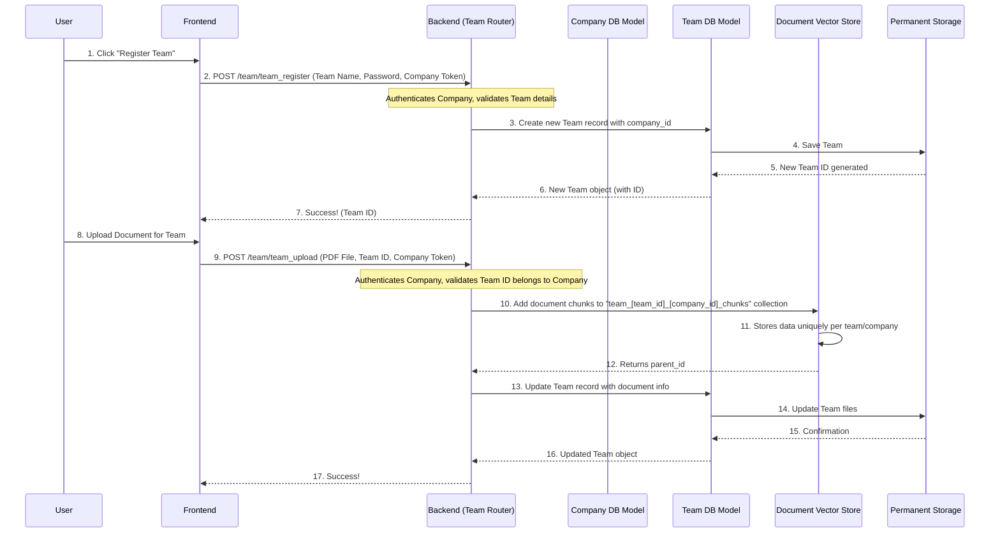

# Chapter 4: Hierarchical Data Management

In the last chapter, [Data Modeling & Validation](03_data_modeling___validation_.md), we learned how to create blueprints for our data (using SQLAlchemy models) and ensure that all information flowing through our system is correct and complete (using Pydantic schemas). We now know how to properly store a "Company" in our database.

But what happens when "MyCorp" wants to organize its documents for its "Sales Team" and "Marketing Team" separately? Or maybe even for a specific "Q3 Project"? We need a way to organize all this information securely, making sure that one team's documents aren't mixed up with another's, and certainly not with another company's!

This is where **Hierarchical Data Management** comes in!

## What Problem Does It Solve?

Imagine DocuAI Navigator is like a massive, secure office building.

*   Each **Company** gets its own floor, complete with its own secure **cabinet**. This cabinet holds all the company's general documents.
*   Inside that company's cabinet, there are separate, locked **folders** for each **Team** and each **Project**.
*   Documents put into a "Sales Team" folder can only be accessed by the "Sales Team" within that specific company. They definitely can't be seen by the "Marketing Team," and *never* by a different company.

This "office structure" is our **Hierarchical Data Management**. It solves the critical problem of **secure partitioning and isolation** of data. It ensures:

1.  **Privacy**: Only authorized users can see relevant documents.
2.  **Relevance**: When you ask an AI a question, it only looks at documents relevant to *your* company, team, or project.
3.  **Organization**: Keeps everything neatly categorized, preventing chaos as more data is added.
4.  **Security**: Prevents data leakage between different entities.

Our central use case for this chapter is: **A company creates a new team, and then uploads a document specifically for that team.** This will demonstrate how the hierarchy isolates data.

## Key Concepts: Building Your Digital Office

To build this digital office, we rely on two main concepts:

### 1. Database Relationships: Connecting the "Cabinets" and "Folders"

Just like real-world cabinets and folders are connected to a specific office, our data entities (`Company`, `Team`, `Project`) are linked in our database. We achieve this using **Foreign Keys** in our SQLAlchemy models.

*   A `Team` "belongs to" a `Company`.
*   A `Project` "belongs to" a `Company`.

This means when you look at a `Team`'s record in the database, you can easily tell *which* `Company` it's associated with.

### 2. Data Isolation: Separate "Storage Rooms" for Documents

When documents are uploaded, they aren't just thrown into one big pile. DocuAI Navigator ensures that documents uploaded at different levels (Company, Team, Project) are stored and retrieved from completely separate, secure "storage rooms."

We do this by creating unique **collections** in our specialized document database (called a **vector store**). Each collection acts like a separate, secured vault for documents belonging to a specific company, team, or project.

## Use Case: Create a Team & Upload a Document to It

Let's walk through how our system handles this use case.

### Step 1: Registering a New Team

Imagine you're logged into DocuAI Navigator as "MyCorp." You want to create a "Sales Team."

1.  **You provide details**: You input the `team_name` (e.g., "Sales Team") and `team_password` into the frontend form.
2.  **Frontend sends request**: Your browser sends a `POST` request to the `/team/team_register` endpoint (as discussed in [API Endpoints & Routing](02_api_endpoints___routing_.md)). This request also includes your login token, which identifies you as "MyCorp."
3.  **Backend validates and saves**:
    *   The backend uses Pydantic schemas (from [Data Modeling & Validation](03_data_modeling___validation_.md)) to ensure your input is valid.
    *   It checks that no other team within *your company* has the same name.
    *   It then creates a new `Team` record in the database, crucially linking it to *your company's ID*.
4.  **Team is created**: The backend responds with the new team's details, including its unique `id`.

### Step 2: Uploading a Document to that Team

Now, with the "Sales Team" created, you want to upload a PDF that only the "Sales Team" should access.

1.  **You select document & specify team**: You select a PDF file and specify the "Sales Team" (using its `id`) in the frontend.
2.  **Frontend sends request**: Your browser sends a `POST` request to the `/team/team_upload` endpoint, including the file, the team's `id`, and your company's login token.
3.  **Backend processes and isolates**:
    *   The backend again verifies your login token and confirms that the provided `team_id` actually belongs to *your company*.
    *   It saves the PDF file to a specific folder on the server, like `uploads/company_123/team_456/document.pdf`.
    *   **Crucially**: The document's content is then broken down and stored in a **special vector store collection that is uniquely named for *that specific team within your company***. This ensures absolute isolation.
4.  **Document uploaded**: The backend updates the team's record in the database to include details about the new document and responds with the updated team information.

Now, if another company or even another team within MyCorp tries to access this document, they simply won't find it because it's stored in a collection they don't have access to!

## How It Works: Under the Hood

Let's visualize the process of creating a team and uploading a document to it.



### 1. Connecting the Data (Database Models)

Our `models.py` file uses SQLAlchemy to define how `Company` and `Team` are linked.

```python
# models.py (Simplified)
from sqlalchemy import Column, Integer, String, ForeignKey, JSON
from sqlalchemy.orm import relationship # Used to define connections

class Team(Base):
    __tablename__ = "team"

    id = Column(Integer, primary_key=True, index=True)
    team_name = Column(String, unique=False, nullable=False)
    team_password = Column(String, nullable=False)
    team_files_name = Column(JSON, nullable=True, default=list) # Stores info about team documents

    # THIS IS THE KEY: Linking to the Company
    company_id = Column(Integer, ForeignKey("company.id"), nullable=False)
    company = relationship("Company", back_populates="teams") # Defines relationship from Team to Company


class Company(Base):
    __tablename__ = "company"

    id = Column(Integer, primary_key=True, index=True)
    username = Column(String, unique=True, index=True, nullable=False)
    company_name = Column(String, unique=True, nullable=False)
    # ... other company fields ...

    # THIS IS THE KEY: Linking to its Teams and Projects
    teams = relationship("Team", back_populates="company", cascade="all, delete")
    projects = relationship("Project", back_populates="company", cascade="all, delete")
```

*   **`company_id = Column(Integer, ForeignKey("company.id"), nullable=False)`**: This line in the `Team` model is critical. It creates a special column `company_id` that stores the `id` of the `Company` this team belongs to. `ForeignKey("company.id")` tells the database that this `company_id` *must* match an `id` in the `company` table. This is how we enforce the "Team belongs to Company" rule!
*   **`teams = relationship("Team", ...)`**: These `relationship` lines allow us to easily access a company's teams (or a team's company) directly from the Python objects, without writing complex database queries.

### 2. Registering and Uploading to a Team (API Endpoints)

In `Routers/team.py`, our API endpoints handle creating teams and linking them to the logged-in company.

**Registering a Team:**

```python
# Routers/team.py (Simplified team_register)
@router.post('/team_register', response_model=schemas.TeamOut)
async def team_register(
    team_user: schemas.TeamCreate,
    current_user: models.Company = Depends(get_current_user), # Identifies the logged-in company
    db: Session = Depends(get_db)
):
    # 1. Check for unique team name within *this company*
    team_existing = db.query(models.Team).filter(
        models.Team.team_name == team_user.team_name,
        models.Team.company_id == current_user.id # Ensures uniqueness per company
    ).first()

    if team_existing:
        raise HTTPException(status_code=400, detail="Team name already exists for this company")

    # 2. Create the new team, assigning it to the current_user's company
    team_obj = models.Team(
        team_name=team_user.team_name,
        team_password=team_user.team_password,
        company_id=current_user.id # Assign the team to the logged-in company
    )

    db.add(team_obj)
    current_user.no_of_teams += 1 # Update company's team count
    db.commit()
    db.refresh(team_obj)
    db.refresh(current_user)

    return team_obj
```

*   `current_user: models.Company = Depends(get_current_user)`: This automatically gets the `Company` object of the currently logged-in user. This is crucial because it gives us `current_user.id`, which is the company's unique identifier.
*   `models.Team.company_id == current_user.id`: When checking for existing teams and creating a new one, we *always* use `current_user.id` to ensure the team is correctly associated with the parent company.

**Uploading a Document to a Team:**

```python
# Routers/team.py (Simplified team_upload)
@router.post("/team_upload", response_model=schemas.TeamOut)
async def team_upload(
    db: Session = Depends(get_db),
    current_user: models.Company = Depends(get_current_user),
    file: UploadFile = File(...),
    team_id: int = Form(...) # The ID of the team to upload to
):
    # 1. Validate: Does this team_id exist AND belong to the current company?
    team = db.query(models.Team).filter(
        models.Team.id == team_id,
        models.Team.company_id == current_user.id # Crucial check!
    ).first()

    if not team:
        raise HTTPException(status_code=404, detail="Team not found under this company")

    # 2. Save file to a specific folder: uploads/company_[id]/team_[id]/
    company_folder = os.path.join("uploads", f"company_{current_user.id}", f"team_{team_id}")
    os.makedirs(company_folder, exist_ok=True)
    # ... file saving logic ...

    # 3. Add document content to the *team-specific* vector store collection
    parent_id = add_documents_to_team(
        str(current_user.id), # Pass company_id
        str(team.id),         # Pass team_id
        documents,
        file_name=unique_filename
    )

    # 4. Update team record in the database with document metadata
    new_file_info = { "pdf_name": extracted_name, "filename": unique_filename, "parent_id": parent_id }
    team.team_files_name.append(new_file_info)

    db.commit()
    db.refresh(team)

    return team
```

*   The line `models.Team.company_id == current_user.id` is repeated here to ensure that a user can only upload documents to a team that truly belongs to their logged-in company. This is a vital security and isolation check.
*   `add_documents_to_team(str(current_user.id), str(team.id), ...)`: This function call is where the magic of data isolation for documents happens. We pass both the company's ID and the team's ID.

### 3. Isolating Documents (Vector Store Collections)

The `Services/vectorstore.py` file contains the logic for managing our document storage.

```python
# Services/vectorstore.py (Simplified for team documents)
import uuid
from langchain.vectorstores import Chroma # Our specialized document database

# ... get_embeddings() function ...

def add_documents_to_team(company_id : str, team_id: str, documents, file_name: str = None):
    # 1. Split the document into smaller pieces (chunks)
    child_splitter = RecursiveCharacterTextSplitter(chunk_size=400, chunk_overlap=100)
    child_docs = child_splitter.split_documents(documents)

    # 2. Add metadata (company_id, team_id) to each chunk for filtering
    parent_id = str(uuid.uuid4())
    for d in child_docs:
        d.metadata['company_id'] = str(company_id)
        d.metadata["team_id"] = str(team_id) # Tagging with team_id
        d.metadata["parent_id"] = parent_id
        if file_name:
            d.metadata["source"] = file_name

    embeddings = get_embeddings()

    # 3. Create a UNIQUE collection name for this team and company!
    collection_name = f"team_{team_id}_{company_id}_chunks"

    # 4. Initialize Chroma with the unique collection name
    vectorstore = Chroma(
        collection_name=collection_name,
        embedding_function=embeddings,
        persist_directory="./chroma_store" # Where the data is saved on disk
    )

    # 5. Add the documents to this specific collection
    vectorstore.add_documents(child_docs)
    vectorstore.persist() # Save to disk
    return parent_id


def get_team_retriever(company_id : str, team_id: str, k: int = 5, fetch_k: int = 20):
    embeddings = get_embeddings()

    # 1. Recreate the SAME unique collection name to access the right data
    collection_name = f"team_{team_id}_{company_id}_chunks"

    vectorstore = Chroma(
        collection_name=collection_name,
        embedding_function=embeddings,
        persist_directory="./chroma_store"
    )

    # 2. Return a retriever that searches ONLY this specific collection
    retriever = vectorstore.as_retriever(
        search_type="mmr",
        search_kwargs={"k": k, "fetch_k": fetch_k}
    )
    return retriever
```

*   **`collection_name = f"team_{team_id}_{company_id}_chunks"`**: This is the core of document isolation! Instead of putting all documents into one big "chunks" collection, we create a distinct collection name for *every single team within every single company*. This ensures that a search for documents for `team_X` of `company_A` will *only* look within `team_X_company_A_chunks` and not accidentally pull up documents from `team_Y` or `company_B`.
*   **`d.metadata["team_id"] = str(team_id)`**: Even though documents are in a team-specific collection, we still tag each chunk with the `team_id` and `company_id` as metadata. This allows for even finer-grained filtering or verification later if needed.

By using both database relationships and unique vector store collections, DocuAI Navigator creates a truly hierarchical and secure environment for your company's valuable information.

## Conclusion

Hierarchical Data Management is about organizing information in a secure, structured way, much like an office building with floors, cabinets, and folders. We use **database relationships** (Foreign Keys in SQLAlchemy models) to link entities like Companies, Teams, and Projects. Crucially, we ensure **document isolation** by creating unique collections in our vector store for each hierarchical level, preventing data leakage and ensuring that AI queries only access relevant information. This foundational structure makes DocuAI Navigator robust, secure, and highly organized.

Next, we'll dive into the exciting part of DocuAI Navigator: how we integrate powerful [Large Language Model (LLM) Integration](05_large_language_model__llm__integration_.md) to make sense of all this organized data!

---

<sub><sup>Generated by [AI Codebase Knowledge Builder](https://github.com/The-Pocket/Tutorial-Codebase-Knowledge).</sup></sub> <sub><sup>**References**: [[1]](https://github.com/aniq63/Docu-AI-Navigator/blob/88058617d37a22d266628a39e74c24e1f503a0a5/Routers/company.py), [[2]](https://github.com/aniq63/Docu-AI-Navigator/blob/88058617d37a22d266628a39e74c24e1f503a0a5/Routers/project.py), [[3]](https://github.com/aniq63/Docu-AI-Navigator/blob/88058617d37a22d266628a39e74c24e1f503a0a5/Routers/team.py), [[4]](https://github.com/aniq63/Docu-AI-Navigator/blob/88058617d37a22d266628a39e74c24e1f503a0a5/Services/vectorestore.py), [[5]](https://github.com/aniq63/Docu-AI-Navigator/blob/88058617d37a22d266628a39e74c24e1f503a0a5/models.py), [[6]](https://github.com/aniq63/Docu-AI-Navigator/blob/88058617d37a22d266628a39e74c24e1f503a0a5/schemas.py)</sup></sub>
