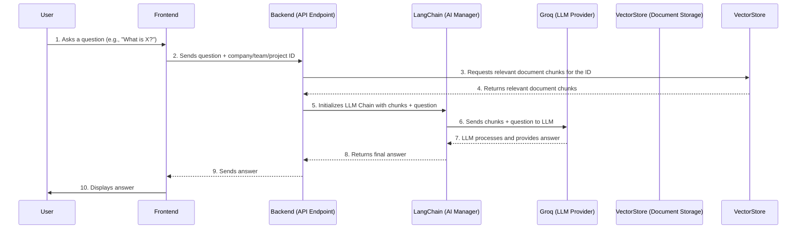

# Chapter 5: Large Language Model (LLM) Integration

In the last chapter, [Hierarchical Data Management](04_hierarchical_data_management_.md), we learned how DocuAI Navigator meticulously organizes your company's documents, keeping them separate for different teams and projects. We've built a digital office with secure cabinets and folders.

But what's the point of having all this perfectly organized information if you can't *do* anything smart with it? How do you quickly find an answer hidden in hundreds of pages, summarize a dense report, or even generate a complex project plan from simple inputs?

This is where **Large Language Model (LLM) Integration** comes in! It's the brain of our DocuAI Navigator, allowing it to perform intelligent tasks using powerful AI.

## What Problem Does It Solve?

Imagine you have a team of highly specialized AI assistants, each brilliant at a different task:

*   One assistant is a lightning-fast researcher who can find specific answers in your vast collection of documents.
*   Another is a master summarizer, able to condense long reports into key points.
*   A third is an expert planner, capable of taking your project idea and crafting a detailed, structured plan.

**LLM Integration** is how DocuAI Navigator taps into these "AI assistants." It's like having a control room where you can choose the right AI assistant for the job, feed it your organized data, and get intelligent responses or actions. This solves the problem of turning raw, organized information into actionable insights and generated content.

Our central use case for this chapter is **asking DocuAI Navigator a question about your uploaded documents and getting a context-aware answer**. We'll also see how it can generate structured information like a project plan.

## Key Concepts: Your Team of AI Assistants

To understand how DocuAI Navigator integrates LLMs, let's break down the core components:

### 1. Large Language Models (LLMs): The Super-Smart Brains

An **LLM** is an advanced AI model that understands and generates human-like text. Think of it as a super-smart, highly knowledgeable assistant that can read, write, and converse.

*   **Role:** The core intelligence that performs tasks like understanding questions, finding answers, summarizing, or generating text.
*   **Analogy:** The actual "brain" of each specialized AI assistant.

### 2. LangChain: The AI Assistant Manager

**LangChain** is a powerful framework (a collection of tools) that helps us easily connect and manage different LLMs and other AI tools. It acts like a universal remote or a project manager for our AI assistants.

*   **Role:** Orchestrates complex interactions with LLMs, manages conversation history, combines multiple AI steps (like searching documents and then answering a question), and ensures smooth data flow.
*   **Analogy:** The "manager" who knows how to assign tasks to the right AI assistant, provide them with all necessary context, and assemble their output into a coherent response.

### 3. Groq: The Speed Demon Provider

**Groq** is a specific **provider** of LLM technology known for its incredible speed. When we use LLMs through Groq, our AI assistants can respond almost instantly, making the user experience much smoother.

*   **Role:** Provides access to very fast LLMs that power our AI assistants.
*   **Analogy:** The "turbo engine" that makes our AI assistants work incredibly quickly, delivering responses almost in real-time.

### 4. Specialized AI Tasks: Different Assistants for Different Jobs

LLM integration isn't just about one general chat. LangChain allows us to create specialized "chains" or "agents" for different purposes:

| Specialized AI Task          | Analogy                       | What it Does in DocuAI Navigator                                      |
| :--------------------------- | :---------------------------- | :-------------------------------------------------------------------- |
| **Name Extraction**          | The "Librarian"               | Reads a document and extracts its main topic or title.                |
| **Conversational AI (RAG)**  | The "Expert Researcher"       | Answers questions by *first* finding relevant documents and *then* using an LLM to formulate an answer. |
| **Structured Plan Generation** | The "Project Manager"         | Takes project details and generates a detailed plan with sections like roadmap, risks, and timeline in a structured format. |

## Use Case: Asking a Question About Your Documents

Let's focus on our main use case: You've uploaded a bunch of documents for "MyCorp" (or a specific team/project), and you want to ask a question like, "What are the key findings from the Q4 sales report?"

Here's how LLM Integration handles this:

1.  **You ask a question:** You type your question into the chat interface (frontend).
2.  **Frontend sends request:** Your browser sends this question to the backend's `/company/chat` (or `/team/team_chat`, `/project/project_chat`) endpoint, along with your company's (or team's/project's) ID.
3.  **Backend prepares for AI:**
    *   It uses the ID to identify *which* specific document collection to search within (remember [Hierarchical Data Management](04_hierarchical_data_management_.md)?).
    *   It sets up a "Conversational AI" chain using LangChain and connects it to a fast Groq LLM.
4.  **AI Assistant (RAG) researches and answers:**
    *   The AI assistant first goes to your dedicated document collection and `retrieves` (finds) the most relevant pieces of information (chunks) related to your question.
    *   It then feeds these relevant chunks and your question to the LLM.
    *   The LLM processes this, considers any past conversation history, and formulates a concise, factual answer based *only* on the provided documents.
5.  **Backend sends answer:** The backend sends the AI's answer back to your frontend.
6.  **You see the answer:** The answer appears in your chat interface.

This entire process makes it feel like you're talking to an expert who has read all your documents and is ready to answer your specific questions.

## How It Works: Under the Hood

Let's trace how DocuAI Navigator uses LangChain and Groq to bring these intelligent features to life.

First, a general overview of an LLM interaction:



Now, let's look at the actual code in `Services/chat_services.py`, `Routers/company.py`, `Routers/team.py`, and `Routers/project.py`.

### 1. Setting up the LLM (Groq)

The first step is to tell LangChain *which* LLM to use and how to access it. We've chosen Groq for its speed.

```python
# Services/chat_services.py (Simplified)
import os
from dotenv import load_dotenv
from langchain_groq.chat_models import ChatGroq
# ... other imports ...

# Load API Key from .env file
load_dotenv()
key = os.getenv("GROQ_API_KEY") # Get your secret key from the .env file

if not key:
    raise ValueError("GROQ_API_KEY is missing. Please add it in your .env file.")

os.environ["GROQ_API_KEY"] = key # Set the environment variable

# Initialize LLM using Groq
llm = ChatGroq(model_name="llama3-8b-8192", groq_api_key=key)
# llm = init_chat_model("openai/gpt-oss-20b", model_provider="groq") is an alternative way
```

*   `load_dotenv()`: This line loads our `GROQ_API_KEY` from the `.env` file, which keeps our secret key secure and separate from the code.
*   `llm = ChatGroq(...)`: This initializes our Large Language Model. We're telling LangChain to use `ChatGroq` (the Groq LLM provider) and specifying a particular model like `"llama3-8b-8192"` (a specific, fast LLM offered by Groq).

### 2. Building a Conversational AI Chain (RAG)

This function creates the "Expert Researcher" assistant that can answer questions using your documents.

```python
# Services/chat_services.py (Simplified conversational_chain)
from langchain.chains import ConversationalRetrievalChain
from langchain.prompts import PromptTemplate
from langchain.memory import ConversationBufferMemory
# ... (llm definition from above) ...

def conversational_chain(retriever):
    # 1. Memory: To remember past questions and answers in the chat
    memory = ConversationBufferMemory(
        memory_key="chat_history",
        return_messages=True,
        output_key="answer"
    )

    # 2. Prompt: Instructions for the LLM on how to answer
    prompt_template = """
    You are an enterprise-grade Document Intelligence Assistant...
    ... Only use information from the given context.
    ... If the answer is not present, reply exactly: "I'm sorry, but the answer is not available..."
    ----
    Context: {context}
    Chat History: {chat_history}
    User Question: {question}
    Final Answer:
    """
    prompt = PromptTemplate(
        template=prompt_template,
        input_variables=["context", "chat_history", "question"]
    )

    # 3. The RAG Chain: Combines LLM, Retriever, and Memory
    chain = ConversationalRetrievalChain.from_llm(
        llm=llm,          # Our Groq LLM
        retriever=retriever, # The tool that finds relevant documents (from Chapter 7)
        memory=memory,     # Our chat history memory
        combine_docs_chain_kwargs={"prompt": prompt}, # Use our custom prompt
        return_source_documents=True, # Optional: return which documents were used
        verbose=False      # Keep it quiet in the background
    )
    return chain
```

*   **`memory = ConversationBufferMemory(...)`**: This is like the AI assistant's short-term memory. It remembers previous turns in the conversation so the AI can understand context ("What about *that* thing you just mentioned?").
*   **`prompt_template`**: This is a set of very specific instructions we give to the LLM. It's like a script for our AI assistant, telling it exactly how to behave (e.g., "only use provided context," "be concise").
*   **`ConversationalRetrievalChain.from_llm(...)`**: This is the core LangChain component for building a RAG (Retrieval-Augmented Generation) chat bot.
    *   `llm`: Our initialized Groq LLM.
    *   `retriever`: This is a special tool (which we'll cover in [Retrieval-Augmented Generation (RAG)](07_retrieval_augmented_generation__rag__.md)) that knows *how to search your documents* and find the most relevant pieces for the question. It's the "researcher" part of our AI assistant.
    *   Together, the `retriever` finds relevant info, the `memory` provides chat history, and the `llm` uses these to answer the `question` according to the `prompt`.

### 3. Calling the Chat Chain from an API Endpoint

Now, let's see how our backend actually *uses* this `conversational_chain` when you chat.

```python
# Routers/company.py (Simplified chat_endpoint)
from fastapi import APIRouter, Depends, HTTPException, Header
from sqlalchemy.orm import Session
import models, schemas # Our database models and data validation schemas
from Services.chat_services import conversational_chain # Our AI assistant
from Services.vectorstore import get_retriever_for_company # Our document search tool
from Routers.company import get_current_user, get_db # Dependencies for auth and DB

@router.post("/chat")
async def chat_endpoint(
    chat: schemas.ChatRequest, # Incoming chat message from the frontend
    current_user: models.Company = Depends(get_current_user), # Authenticated user
    db: Session = Depends(get_db)
):
    try:
        company_id = str(current_user.id)
        
        # 1. Get the document retriever specifically for this company
        retriever = get_retriever_for_company(company_id, k=5, fetch_k=20)
        
        # 2. Build the conversational chain (our AI assistant)
        chain = conversational_chain(retriever)

        # 3. Invoke the chain with the user's question
        result = chain.invoke({"question": chat.message})
        answer = result["answer"]

        return {"answer": answer}

    except Exception as e:
        raise HTTPException(status_code=500, detail=str(e))
```

*   `retriever = get_retriever_for_company(company_id, ...)`: This line is crucial! It gets a `retriever` that is *specifically configured to search only the documents belonging to the `current_user`'s company*. This ensures data isolation as explained in [Hierarchical Data Management](04_hierarchical_data_management_.md).
*   `chain = conversational_chain(retriever)`: Here, we create our "Expert Researcher" assistant, providing it with the `retriever` that knows where to find *your* company's documents.
*   `result = chain.invoke({"question": chat.message})`: This line actually *sends* your question to the AI assistant. The `chain` then uses the `retriever` to find documents, consults its `memory` for context, and uses the `llm` to generate the `answer`.

Similar endpoints (`/team/team_chat`, `/project/project_chat`) exist, which simply use `get_team_retriever` or `get_project_retriever` to ensure the AI only accesses documents relevant to that specific team or project.

### 4. Extracting a Document Name

Another specialized task is extracting a name from a document. This is our "Librarian" assistant.

```python
# Services/chat_services.py (Simplified extract_name_from_pdf)
from langchain_core.output_parsers import StrOutputParser
from langchain_core.prompts import ChatPromptTemplate
# ... (llm definition from above) ...

def extract_name_from_pdf(documents):
    # Combine all text from the document pages
    full_text = " ".join([doc.page_content for doc in documents])

    # Prompt: Instructions for the LLM
    prompt = ChatPromptTemplate.from_messages([
        ("system", "You are an expert at reading a document and generating a short, accurate name for it."),
        ("user", "Document text:\n{text}\n\nOutput ONLY the name. No reasoning, no explanation.")
    ])

    # Parser: To get a simple string output
    parser = StrOutputParser()

    # Chain: Prompt -> LLM -> Parser
    chain = prompt | llm | parser # LangChain's simple way to chain steps
    name = chain.invoke({"text": full_text}).strip()
    return name
```

*   `prompt = ChatPromptTemplate.from_messages(...)`: This sets up a simpler prompt for the LLM, focusing only on extracting a name.
*   `parser = StrOutputParser()`: This tells LangChain that we expect the LLM's output to be just a plain string (text).
*   `chain = prompt | llm | parser`: This is LangChain's "chaining" syntax. It means: take the `prompt`, pass it to the `llm`, and then pass the `llm`'s output through the `parser`. It's a clear flow for simple tasks.
*   This function is called when a document is uploaded, as seen in the `upload_pdf` endpoint in `Routers/company.py`, `Routers/team.py`, and `Routers/project.py`.

### 5. Generating a Structured Project Plan

This is our "Project Manager" assistant, capable of generating complex, structured output.

```python
# Services/chat_services.py (Simplified build_project_plan)
from pydantic import BaseModel, Field
from typing import List, Dict
from langchain_core.runnables import RunnablePassthrough
# ... (llm definition from above) ...

def build_project_plan(
    domain: str, project_name: str, # ... other project details ...
):
    # 1. Define the desired output structure using Pydantic
    class ProjectPlan(BaseModel):
        project_overview: str = Field(description="Summary of the project")
        team_structure: Dict[str, str] = Field(description="Roles and responsibilities")
        roadmap: List[str] = Field(description="Step-by-step roadmap")
        # ... more fields for timeline, risks, etc. ...

    parser = PydanticOutputParser(pydantic_object=ProjectPlan)

    # 2. Advanced Prompt with detailed instructions and placeholders
    prompt_template = """
    You are an expert in the {domain} domain...
    The project is called "{project_name}"...
    ... Provide a comprehensive, detailed, and structured project plan.
    ... Return your answer strictly in the structured format described below.
    {format_instructions} # This gets Pydantic's format guidance
    """
    prompt = ChatPromptTemplate.from_messages([
        ("system", prompt_template),
    ])

    # 3. Build the chain for structured output
    chain = (
        { # Prepare inputs for the prompt
            "domain": RunnablePassthrough(), # Pass 'domain' directly
            "project_name": RunnablePassthrough(),
            # ... pass other inputs ...
            "format_instructions": lambda _: parser.get_format_instructions(), # Insert Pydantic format here
        }
        | prompt # Feed inputs to prompt
        | llm    # Send to LLM
        | parser # Parse LLM's output into our Pydantic object
    )

    # 4. Invoke the chain with all project details
    result = chain.invoke({
        "domain": domain, "project_name": project_name,
        # ... provide all other inputs ...
    })
    return result
```

*   `class ProjectPlan(BaseModel):`: This uses Pydantic (from [Data Modeling & Validation](03_data_modeling___validation_.md)) to define the *exact structure* we expect the LLM to output (e.g., `project_overview` must be a string, `roadmap` must be a list of strings). This is powerful for reliable, machine-readable output.
*   `parser = PydanticOutputParser(...)`: This LangChain parser takes the LLM's raw text response and tries to *force* it into our `ProjectPlan` Pydantic structure. If the LLM doesn't follow the format, the parser helps it correct itself or raises an error.
*   `{format_instructions}`: We include a special placeholder in our prompt that Pydantic fills with very explicit instructions for the LLM on *how to format its output* to match our `ProjectPlan` schema.
*   `RunnablePassthrough()` and `chain = ({...} | prompt | llm | parser)`: These are advanced LangChain features that make it easy to manage inputs and chain multiple steps together in a clear and robust way.
*   This `build_project_plan` function is called from the `/project/plan` endpoint in `Routers/project.py`.

By strategically combining LangChain's orchestration capabilities with fast LLM providers like Groq, and tailoring prompts and output formats, DocuAI Navigator creates a suite of powerful, intelligent AI assistants that can perform diverse tasks efficiently and accurately.

## Conclusion

LLM Integration is the heart of DocuAI Navigator's intelligence. By leveraging powerful Large Language Models through frameworks like LangChain and fast providers like Groq, our system can act as a team of specialized AI assistants. Whether it's answering questions about your documents using conversational AI (RAG), extracting key information, or generating complex, structured project plans, these integrated LLMs turn your organized data into actionable insights. This capability transforms DocuAI Navigator from a simple document manager into a truly intelligent system.

Next, we'll delve into how documents actually get into the system and are prepared for these AI assistants to use, in [Document Ingestion & Processing](06_document_ingestion___processing_.md).

---

<sub><sup>Generated by [AI Codebase Knowledge Builder](https://github.com/The-Pocket/Tutorial-Codebase-Knowledge).</sup></sub> <sub><sup>**References**: [[1]](https://github.com/aniq63/Docu-AI-Navigator/blob/88058617d37a22d266628a39e74c24e1f503a0a5/.env), [[2]](https://github.com/aniq63/Docu-AI-Navigator/blob/88058617d37a22d266628a39e74c24e1f503a0a5/Routers/company.py), [[3]](https://github.com/aniq63/Docu-AI-Navigator/blob/88058617d37a22d266628a39e74c24e1f503a0a5/Routers/project.py), [[4]](https://github.com/aniq63/Docu-AI-Navigator/blob/88058617d37a22d266628a39e74c24e1f503a0a5/Routers/team.py), [[5]](https://github.com/aniq63/Docu-AI-Navigator/blob/88058617d37a22d266628a39e74c24e1f503a0a5/Services/chat_services.py)</sup></sub>
