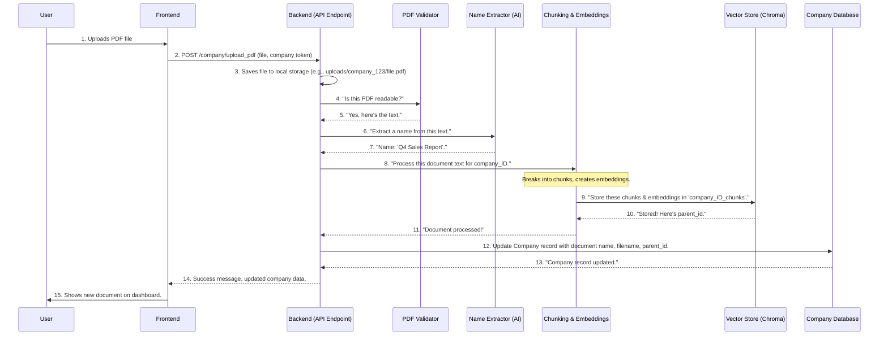

# Chapter 6: Document Ingestion & Processing

In the last chapter, [Large Language Model (LLM) Integration](05_large_language_model__llm__integration_.md), we explored how DocuAI Navigator uses powerful AI to answer questions and generate content from your documents. But before an AI can "read" and "understand" a document, that document first needs to get *into* the system and be prepared in a special way.

Think of it like feeding information to a very intelligent but very particular robot. You can't just throw a whole book at it and expect an instant answer. The robot needs the book opened, pages scanned, text extracted, and important parts highlighted. This entire process is handled by **Document Ingestion & Processing**.

## What Problem Does It Solve?

Imagine DocuAI Navigator has a special "document preparation workshop." When you upload a PDF, it doesn't just store the file; it sends it to this workshop to get it ready for AI analysis. This workshop has several stations, each with a specific job:

1.  **Quality Control (Validator):** "Is this PDF readable? Can we actually get text out of it?"
2.  **Chopping Station (Chunking):** "This book is too big! Let's chop it into smaller, manageable chapters or paragraphs."
3.  **Fingerprint Lab (Embeddings):** "Now, for each small piece, let's create a unique digital 'fingerprint' that captures its meaning."
4.  **Smart Filing Cabinet (Vector Store):** "Finally, let's file these fingerprints in a super organized, searchable cabinet so the AI can find them instantly."

**Document Ingestion & Processing** is this entire pipeline. It solves the problem of transforming raw, complex documents (like PDFs) into a structured, AI-ready format that can be quickly and intelligently searched and understood by our Large Language Models.

Our central use case for this chapter is: **You upload a new PDF document, and DocuAI Navigator automatically prepares it so the AI can later answer questions about its content.**

## Key Concepts: The Document Preparation Workshop

Let's break down the different stations in our document preparation workshop.

### 1. Document Validation: The Quality Check

Before doing anything else, DocuAI Navigator performs a quick quality check. Can the PDF file actually be opened and read? Is it corrupted, or perhaps just an image without selectable text?

*   **Role**: Ensures the incoming document is valid and extractable.
*   **Analogy**: The workshop's "door guard" who makes sure only proper documents enter.

### 2. Document Chunking: Breaking Down the Big Picture

Large documents (like a 100-page report) are too much for an AI to process all at once for every question. It's like asking someone to remember every single word of a massive textbook just to answer one specific question.

*   **Role**: Divides a long document into smaller, more manageable pieces (called "chunks" or "segments"). This allows the AI to focus on only the relevant parts when answering questions.
*   **Analogy**: Chopping a large book into individual chapters, sections, or even paragraphs.

### 3. Embeddings: Giving Documents Digital Meaning

Once we have smaller chunks, how does the AI understand what each chunk is *about*? We convert each text chunk into a special list of numbers called an **embedding**.

*   **Role**: Transforms human-readable text into a numerical format that AI models can understand and process. Chunks with similar meanings will have "fingerprints" (embeddings) that are numerically close to each other.
*   **Analogy**: Creating a unique "digital fingerprint" for each chunk. Pieces with similar content will have similar fingerprints.

### 4. Vector Store: The Smart Filing Cabinet

Now that each chunk has a digital fingerprint (embedding), we need a place to store them efficiently so the AI can quickly find the most relevant ones when asked a question.

*   **Role**: A specialized database that stores these numerical embeddings. It's optimized for finding "similar" fingerprints very, very quickly.
*   **Analogy**: A "smart filing cabinet" where you can describe what you're looking for, and it instantly pulls out all files with similar fingerprints, even if you don't know the exact keyword. For DocuAI Navigator, we use **Chroma** as our vector store.

## Use Case: Uploading a PDF

Let's trace what happens when you upload a PDF through the DocuAI Navigator frontend.

1.  **You upload a file**: On your company dashboard, you click the "Upload Document" button and select a PDF file.
2.  **Frontend sends the file**: Your browser (the frontend, from [Frontend User Interface](01_frontend_user_interface_.md)) sends the PDF file to the backend server's `/company/upload_pdf` API endpoint (from [API Endpoints & Routing](02_api_endpoints___routing_.md)). It also includes your login token to identify your company.
3.  **Backend saves and processes**:
    *   The backend saves the PDF file to a secure location on the server, specific to your company.
    *   It then passes this saved file to the **Document Validator** to ensure it's readable.
    *   Next, the extracted text is sent to our AI's "Librarian" assistant (from [Large Language Model (LLM) Integration](05_large_language_model__llm__integration_.md)) to give the document a simple, readable name.
    *   The document's content is then broken into **chunks**.
    *   Each chunk is given a unique **embedding** (digital fingerprint).
    *   These embeddings are then stored in your company's dedicated **vector store collection** (our "smart filing cabinet"). This ensures that your documents are isolated, as we learned in [Hierarchical Data Management](04_hierarchical_data_management_.md).
4.  **Backend confirms upload**: The backend updates your company's record in the database with the new document's metadata (like its name and original filename) and sends a success message back to the frontend.
5.  **Document appears on dashboard**: You see the newly uploaded document listed on your dashboard, ready for AI interaction!

## How It Works: Under the Hood

Let's visualize this ingestion process:



Now, let's look at the key code snippets involved in this pipeline.

### 1. Receiving the Uploaded File (`Routers/company.py`)

The `/company/upload_pdf` endpoint is where the backend receives your uploaded file.

```python
# Routers/company.py (Simplified upload_pdf endpoint)
# ... imports ...
@router.post("/upload_pdf", response_model=schemas.CompanyOut)
async def upload_pdf(
    file: UploadFile = File(...), # FastAPI automatically handles the uploaded file
    current_user: models.Company = Depends(get_current_user), # Ensures user is logged in
    db: Session = Depends(get_db)
):
    try:
        # 1. Create a folder specific to the company to store files
        company_folder = os.path.join("uploads", f"company_{current_user.id}")
        os.makedirs(company_folder, exist_ok=True)

        # 2. Give the file a unique name to avoid conflicts
        unique_filename = f"{uuid.uuid4().hex}_{file.filename}"
        saved_path = os.path.join(company_folder, unique_filename)

        # 3. Save the uploaded file to disk
        with open(saved_path, "wb") as buffer:
            shutil.copyfileobj(file.file, buffer)

        # --- The processing steps happen here ---
        # (covered in the next sections)

        # 4. Update the company's database record
        # (after processing, we add metadata like name and parent_id)
        # current_user.company_files_name.append(extracted_info)
        # db.commit(); db.refresh(current_user)

        return current_user # Return updated company info
    except Exception as e:
        raise HTTPException(status_code=500, detail=str(e))
```

*   `file: UploadFile = File(...)`: This tells FastAPI to expect a file upload. `UploadFile` is a special type that makes it easy to work with uploaded files.
*   `os.makedirs(...)` and `shutil.copyfileobj(...)`: These lines handle creating the folder for your company and saving the actual PDF file to our server.

### 2. Validating the PDF (`Services/pdf_validator.py`)

After saving, the first actual processing step is to validate and load the PDF's content.

```python
# Services/pdf_validator.py
from langchain_community.document_loaders import PyPDFLoader # Tool to load PDFs

def document_validator(file_path):
    # PyPDFLoader is a LangChain tool that reads a PDF
    loader = PyPDFLoader(file_path)
    # It extracts text from each page and creates 'document' objects
    documents = loader.load()
    if not documents:
        raise ValueError("No documents were loaded. Check the file path or PDF content.")
    return documents
```

*   `PyPDFLoader`: This is a helper from LangChain (our AI assistant manager, from [Large Language Model (LLM) Integration](05_large_language_model__llm__integration_.md)) that knows how to open a PDF file, read its pages, and extract all the text. It creates a list of "document" objects, where each object represents a page from the PDF.
*   `loader.load()`: This is where the text extraction happens. If the PDF is just images without selectable text, this might return an empty list or raise an error.

### 3. Extracting a Readable Name (`Services/chat_services.py`)

To make the document list friendly, we use an LLM to give the PDF a simple, descriptive name.

```python
# Services/chat_services.py (Simplified extract_name_from_pdf)
# ... imports ...
# (llm is already defined, as covered in Chapter 5)

def extract_name_from_pdf(documents):
    # Combine all text from the document pages into one big string
    full_text = " ".join([doc.page_content for doc in documents])

    # This is a special instruction for the LLM
    prompt = ChatPromptTemplate.from_messages([
        ("system", "You are an expert at reading a document and generating a short, accurate name for it. "),
        ("user", "Document text:\n{text}\n\nOutput ONLY the name. No reasoning, no explanation.")
    ])

    parser = StrOutputParser() # We expect a simple text name as output

    # Chain: Prompt -> LLM -> Parser (as seen in Chapter 5)
    chain = prompt | llm | parser
    name = chain.invoke({"text": full_text}).strip()
    return name
```

*   This function leverages the LLM integration we discussed in Chapter 5. It feeds the entire document's text to a powerful LLM with a specific instruction (`prompt`) to simply output a concise name. This means "Q4 Sales Report" instead of `some_long_technical_report_2023_final_v2.pdf`.

### 4. Chunking, Embedding, and Storing (`Services/vectorstore.py`)

This is the core of our document preparation workshop, handled by the `add_documents_to_collection` function.

```python
# Services/vectorstore.py (Simplified)
from langchain.text_splitter import RecursiveCharacterTextSplitter # Our chunking tool
from langchain_huggingface import HuggingFaceEmbeddings # Our embedding creator
from langchain.vectorstores import Chroma # Our smart filing cabinet (Vector Store)
import uuid

# Helper to get the embedding model (digital fingerprint creator)
def get_embeddings():
    # This loads a pre-trained model that creates embeddings
    return HuggingFaceEmbeddings(
        model_name="sentence-transformers/all-MiniLM-L6-v2",
        model_kwargs={"device": "cpu"} # Using CPU for simplicity
    )

# Function to add documents to the Vector Store
def add_documents_to_collection(company_id: str, documents, file_name: str = None):
    # 1. Chunking: Break the document into smaller pieces
    child_splitter = RecursiveCharacterTextSplitter(chunk_size=400, chunk_overlap=100)
    child_docs = child_splitter.split_documents(documents)

    # 2. Add useful metadata to each chunk
    parent_id = str(uuid.uuid4()) # Unique ID for the whole original document
    for d in child_docs:
        d.metadata["company_id"] = str(company_id) # Tag with company ID
        d.metadata["parent_id"] = parent_id # Link to original document
        if file_name:
            d.metadata["source"] = file_name # Keep original filename

    # 3. Create embeddings (digital fingerprints) for each chunk
    embeddings = get_embeddings()

    # 4. Define the collection name for the Vector Store
    # This ensures document isolation per company (as in Chapter 4)
    collection_name = f"company_{company_id}_chunks"

    # 5. Initialize Chroma (our Vector Store)
    vectorstore = Chroma(
        collection_name=collection_name,
        embedding_function=embeddings, # Tell Chroma how to make fingerprints
        persist_directory="./chroma_store" # Where to save data on disk
    )

    # 6. Add the chunks and their embeddings to the Vector Store
    vectorstore.add_documents(child_docs)

    # 7. Save changes to disk
    try:
        vectorstore.persist()
    except Exception:
        pass # Some versions of Chroma persist automatically

    return parent_id # Return the ID of the original document
```

*   `RecursiveCharacterTextSplitter`: This is our "chopping machine." It intelligently breaks down the `documents` (list of pages) into `child_docs` (smaller chunks), trying to keep sentences and paragraphs together. `chunk_size` means roughly 400 characters per chunk, and `chunk_overlap` means chunks can share 100 characters to provide context.
*   `d.metadata[...]`: For each chunk, we add important "tags" like `company_id` and `parent_id`. This metadata helps us later to retrieve documents only for the correct company and to group chunks belonging to the same original file.
*   `HuggingFaceEmbeddings`: This is the tool that generates the numerical "fingerprint" (embedding) for each text chunk. It uses a pre-trained AI model (`all-MiniLM-L6-v2`) to do this.
*   `collection_name = f"company_{company_id}_chunks"`: This is critical for [Hierarchical Data Management](04_hierarchical_data_management_.md). Instead of one giant collection for all documents, we create a *unique* collection for each company (and similarly for teams and projects). This acts as a separate, secure filing cabinet.
*   `Chroma(...)`: This initializes our `Chroma` vector store. We tell it which `collection_name` to use (your company's unique cabinet) and which `embedding_function` to use to create the fingerprints.
*   `vectorstore.add_documents(child_docs)`: This command takes all the processed chunks, generates their embeddings, and stores them in your company's dedicated collection within the Chroma vector store. Now they are ready for fast, AI-powered search!

This entire sequence, from validation to saving in the vector store, ensures that every document you upload is thoroughly prepared, organized, and optimized for intelligent analysis by DocuAI Navigator's Large Language Models.

## Conclusion

Document Ingestion & Processing is the crucial first step that transforms raw PDF files into AI-ready information. It involves validating the document, intelligently breaking it into smaller chunks, converting those chunks into numerical "digital fingerprints" (embeddings), and storing them in a specialized "smart filing cabinet" (vector store like Chroma). This meticulous preparation ensures that when you ask DocuAI Navigator a question, its AI can efficiently and accurately retrieve relevant information from your documents, providing precise and context-aware answers.

With our documents now neatly organized and ready, we can finally dive into how the AI actually *uses* this information to answer your questions through a powerful technique called [Retrieval-Augmented Generation (RAG)](07_retrieval_augmented_generation__rag__.md).

---

<sub><sup>Generated by [AI Codebase Knowledge Builder](https://github.com/The-Pocket/Tutorial-Codebase-Knowledge).</sup></sub> <sub><sup>**References**: [[1]](https://github.com/aniq63/Docu-AI-Navigator/blob/88058617d37a22d266628a39e74c24e1f503a0a5/Routers/company.py), [[2]](https://github.com/aniq63/Docu-AI-Navigator/blob/88058617d37a22d266628a39e74c24e1f503a0a5/Routers/project.py), [[3]](https://github.com/aniq63/Docu-AI-Navigator/blob/88058617d37a22d266628a39e74c24e1f503a0a5/Routers/team.py), [[4]](https://github.com/aniq63/Docu-AI-Navigator/blob/88058617d37a22d266628a39e74c24e1f503a0a5/Services/chat_services.py), [[5]](https://github.com/aniq63/Docu-AI-Navigator/blob/88058617d37a22d266628a39e74c24e1f503a0a5/Services/pdf_validator.py), [[6]](https://github.com/aniq63/Docu-AI-Navigator/blob/88058617d37a22d266628a39e74c24e1f503a0a5/Services/vectorestore.py)</sup></sub>
