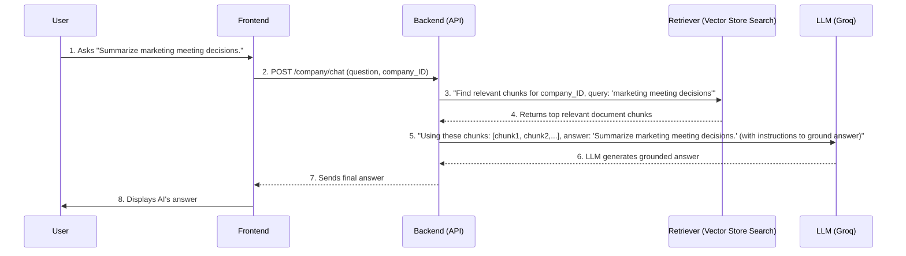

# Chapter 7: Retrieval-Augmented Generation (RAG)

In the last chapter, [Document Ingestion & Processing](06_document_ingestion___processing_.md), we saw how DocuAI Navigator carefully prepares your uploaded documents. We learned how it breaks them into smaller pieces (`chunks`), gives each piece a unique digital "fingerprint" (`embedding`), and stores these fingerprints in a "smart filing cabinet" called a `Vector Store`. Your documents are now perfectly organized and ready for action!

But how does DocuAI Navigator actually *use* these prepared documents to answer your questions accurately? If you ask a question like "What was our sales growth in Q3?" how does the AI know to look *only* at your sales reports and not just make up an answer based on general knowledge?

This is where **Retrieval-Augmented Generation (RAG)** comes in!

## What Problem Does It Solve?

Imagine you have a vast, organized library full of all your company's documents (our **Vector Store**). You also have a very smart but general-purpose librarian (our **Large Language Model**, or LLM, from [Large Language Model (LLM) Integration](05_large_language_model__llm__integration_.md)).

If you just ask the librarian a question, they might give you a general answer from their vast general knowledge, which might not be specific to *your* company's documents.

RAG solves this by teaching the librarian a special two-step process:

1.  **Step 1: Retrieval (Go to the Library!)**: When you ask a question, the librarian doesn't just answer from memory. First, they *retrieve* (find) the most relevant "pages" or "sections" (document chunks) from *your* specific library (your Vector Store).
2.  **Step 2: Augmented Generation (Answer using the Books!)**: Then, the librarian uses these newly retrieved, relevant pages to *augment* (add to) their own knowledge and construct a precise, factual answer. This ensures the response is always grounded in *your* uploaded documents, not just general internet information.

This mechanism enables DocuAI Navigator to answer questions accurately and factually using *only* your specific, uploaded documents, making it a reliable and trustworthy source of information for your company.

Our central use case for this chapter is: **You ask DocuAI Navigator a question about your uploaded documents (e.g., "What is mentioned about project X in the sales report?") and get a precise answer based on those documents.**

## Key Concepts: The Two Sides of RAG

RAG is fundamentally a two-step process. Let's break it down:

### 1. Retrieval: Finding the Needles in the Haystack

This is the "go to the library" step. When you ask a question, the system needs to intelligently sift through all your documents to find the few pieces of information that are most relevant to your query.

*   **How it works**:
    1.  Your question is converted into a digital "fingerprint" (an embedding), just like your document chunks were (from [Document Ingestion & Processing](06_document_ingestion___processing_.md)).
    2.  The system searches the **Vector Store** for document chunks whose fingerprints are most "similar" (numerically close) to your question's fingerprint.
    3.  It `retrieves` the top few most relevant chunks.
*   **Goal**: To get only the most pertinent information to guide the LLM's answer, ignoring irrelevant data.

### 2. Augmented Generation: Crafting the Grounded Answer

This is the "answer using the books" step. Once the relevant chunks are found, they are combined with your original question and sent to the Large Language Model.

*   **How it works**:
    1.  The LLM receives your question *and* the retrieved document chunks.
    2.  It also receives a special set of instructions (a `prompt`) telling it to answer *only* based on the provided chunks.
    3.  The LLM then generates a natural-sounding answer, ensuring it's factual and directly supported by the retrieved context.
*   **Goal**: To produce an accurate, context-aware, and human-readable answer that is *grounded* in your documents.

## Use Case: Asking a Question About Your Documents

Let's walk through our use case: You are on your company's dashboard, and you ask DocuAI Navigator a question like "Summarize the key decisions from the last marketing meeting."

1.  **You ask a question**: You type your question into the chat box on the frontend.
2.  **Frontend sends request**: Your browser sends this question to the backend's `/company/chat` endpoint, along with your company's ID and authentication token.
3.  **Backend sets up for RAG**:
    *   The backend confirms your company's identity using your token.
    *   It uses your company's ID to fetch the correct **Retriever** that knows how to search *only* your company's documents within the Vector Store (this ensures [Hierarchical Data Management](04_hierarchical_data_management__.md) and privacy).
    *   It then creates a **Conversational Chain** (using LangChain, from [Large Language Model (LLM) Integration](05_large_language_model__llm__integration__.md)) that combines the LLM and this specific Retriever.
4.  **RAG in action**:
    *   The `Retriever` takes your question and searches your company's Vector Store to find the most relevant document chunks related to "marketing meeting" and "key decisions."
    *   These retrieved chunks, along with your original question and any past chat history, are passed to the **Large Language Model** (LLM).
    *   The LLM, guided by a prompt that tells it to use *only* the provided context, generates a concise summary of the key decisions.
5.  **Backend sends answer**: The backend receives the LLM's answer and sends it back to your frontend.
6.  **You see the answer**: The answer appears in your chat interface, directly addressing your question based on your documents.

## How It Works: Under the Hood

Let's visualize the RAG process with our core components:



Now let's dive into the code that makes this happen, referencing the files `Services/vectorstore.py`, `Services/chat_services.py`, and `Routers/company.py`.

### 1. The Retriever: Your Document Search Tool (`Services/vectorstore.py`)

First, we need the tool that knows how to find relevant documents. This is the `retriever` we create from our `Vector Store`. Remember from [Hierarchical Data Management](04_hierarchical_data_management__.md) that we have separate collections for each company, team, and project.

```python
# Services/vectorstore.py (Simplified get_retriever_for_company)
from langchain.vectorstores import Chroma
from langchain_huggingface import HuggingFaceEmbeddings # Used for embeddings

def get_embeddings():
    # This is the same model used to create document fingerprints (embeddings)
    return HuggingFaceEmbeddings(
        model_name="sentence-transformers/all-MiniLM-L6-v2"
    )

def get_retriever_for_company(company_id: str, k: int = 5, fetch_k: int = 20):
    embeddings = get_embeddings() # Get our embedding model

    # Define the *unique* collection name for this company
    collection_name = f"company_{company_id}_chunks"

    # Initialize Chroma (our Vector Store) for this specific collection
    vectorstore = Chroma(
        collection_name=collection_name,
        embedding_function=embeddings,
        persist_directory="./chroma_store" # Where data is saved on disk
    )

    # Convert the vector store into a retriever
    retriever = vectorstore.as_retriever(
        search_type="mmr", # A smart search type for diverse results
        search_kwargs={"k": k, "fetch_k": fetch_k} # How many results to fetch
    )
    return retriever
```

*   `collection_name = f"company_{company_id}_chunks"`: This line is fundamental. It ensures that the retriever only searches within the documents specifically belonging to the given `company_id`.
*   `vectorstore.as_retriever(...)`: This transforms our `Chroma` database (which stores the document fingerprints) into a `retriever` object. This `retriever` is now capable of taking a text query and returning the most relevant document chunks from that specific `collection_name`.
*   `search_type="mmr"`: MMR (Maximal Marginal Relevance) is a clever way to select document chunks. Instead of just picking the *most similar* chunks (which might be very repetitive), it tries to find chunks that are both similar to the query *and* diverse from each other. This gives the LLM a broader, less redundant context.

### 2. The Conversational Chain: Orchestrating RAG (`Services/chat_services.py`)

Next, we integrate this `retriever` into our LangChain conversational setup, which we first encountered in [Large Language Model (LLM) Integration](05_large_language_model__llm__integration__.md).

```python
# Services/chat_services.py (Simplified conversational_chain)
from langchain_groq.chat_models import ChatGroq # Our fast LLM provider
from langchain.chains import ConversationalRetrievalChain # The RAG chain
from langchain.prompts import PromptTemplate # Instructions for the LLM
from langchain.memory import ConversationBufferMemory # To remember chat history

# (llm is already defined, using ChatGroq as seen in Chapter 5)

def conversational_chain(retriever):
    # Memory to keep track of previous questions and answers
    memory = ConversationBufferMemory(
        memory_key="chat_history",
        return_messages=True,
        output_key="answer"
    )

    # Instructions for the LLM on how to answer, using the provided context
    prompt_template = """
    You are an enterprise-grade Document Intelligence Assistant...
    ... Only use information from the given context.
    ... If the answer is not present, reply exactly: "I'm sorry, but the answer is not available..."
    ----
    Context: {context}
    Chat History: {chat_history}
    User Question: {question}
    Final Answer:
    """
    prompt = PromptTemplate(
        template=prompt_template,
        input_variables=["context", "chat_history", "question"]
    )

    # The core RAG chain: combines LLM, retriever, and memory
    chain = ConversationalRetrievalChain.from_llm(
        llm=llm,          # Our LLM (e.g., Groq's Llama3)
        retriever=retriever, # Our document search tool from vectorstore.py
        memory=memory,     # Our chat history memory
        combine_docs_chain_kwargs={"prompt": prompt}, # Use our custom prompt
        return_source_documents=True # Optionally return which docs were used
    )
    return chain
```

*   `retriever=retriever`: This is the crucial part! We pass the `retriever` (which is configured for the specific company/team/project) directly into the `ConversationalRetrievalChain`. This tells the chain: "When you need to answer a question, use *this* specific tool to find relevant documents."
*   `prompt_template`: Notice the `{context}` variable in the prompt. This is where the retrieved document chunks are inserted by LangChain before the prompt is sent to the LLM. The prompt then explicitly instructs the LLM to use *only* this provided context.
*   `ConversationalRetrievalChain`: This LangChain component cleverly orchestrates the entire RAG process:
    1.  It takes the user's `question`.
    2.  It uses the `retriever` to get relevant `context` (document chunks).
    3.  It combines the `question`, `context`, and `chat_history` into the `prompt`.
    4.  It sends this complete prompt to the `llm` (Groq).
    5.  It receives and returns the `llm`'s `answer`.

### 3. The API Endpoint: Where You Chat (`Routers/company.py`)

Finally, this is the endpoint that users interact with. It brings together the authentication, the retriever, and the conversational chain.

```python
# Routers/company.py (Simplified chat_endpoint)
from fastapi import APIRouter, Depends, HTTPException, Header
from sqlalchemy.orm import Session
import models, schemas # Our database models and data validation schemas
from Services.chat_services import conversational_chain # Our AI assistant
from Services.vectorstore import get_retriever_for_company # Our document search tool
from Routers.company import get_current_user, get_db # Dependencies for auth and DB

@router.post("/chat")
async def chat_endpoint(
    chat: schemas.ChatRequest, # Incoming chat message from the frontend
    current_user: models.Company = Depends(get_current_user), # Authenticated user
    db: Session = Depends(get_db)
):
    try:
        company_id = str(current_user.id)
        
        # 1. Get the document retriever specifically for this company
        retriever = get_retriever_for_company(company_id, k=5, fetch_k=20)
        
        # 2. Build the conversational chain (our RAG-powered AI assistant)
        chain = conversational_chain(retriever)

        # 3. Invoke the chain with the user's question
        result = chain.invoke({"question": chat.message})
        answer = result["answer"]

        return {"answer": answer}

    except Exception as e:
        raise HTTPException(status_code=500, detail=str(e))
```

*   `current_user: models.Company = Depends(get_current_user)`: This line ensures that only a logged-in user can chat and importantly, provides us with `current_user.id`.
*   `retriever = get_retriever_for_company(company_id, ...)`: Here, we dynamically get the retriever that is isolated to the *current user's company documents*. If it were a team chat, we'd use `get_team_retriever`.
*   `chain = conversational_chain(retriever)`: We instantiate our RAG-powered chat chain, ready to answer questions.
*   `result = chain.invoke({"question": chat.message})`: This is where the magic happens! We pass the user's question to the RAG chain. It internally performs retrieval and augmented generation, and `result["answer"]` holds the LLM's final, grounded response.

By bringing together the uniquely scoped `retriever` (from `vectorstore.py`) with the powerful `ConversationalRetrievalChain` (from `chat_services.py`), DocuAI Navigator provides a highly accurate and contextually relevant chat experience, always grounded in *your* documents.

## Conclusion

Retrieval-Augmented Generation (RAG) is the core intelligence that allows DocuAI Navigator to provide accurate, factual answers from your specific documents. By combining the power of intelligent **Retrieval** from your personalized **Vector Store** (from [Document Ingestion & Processing](06_document_ingestion___processing_.md)) with the advanced text generation capabilities of **Large Language Models** (from [Large Language Model (LLM) Integration](05_large_language_model__llm__integration__.md)), RAG ensures that every answer is trustworthy and directly relevant to your data. This makes DocuAI Navigator an indispensable tool for extracting insights and information from your company's vast knowledge base.

This concludes our tutorial chapters on the DocuAI Navigator project. You've learned how a user interacts with the system, how the backend handles requests, organizes data, processes documents, and finally leverages powerful AI to answer questions using RAG.

---

<sub><sup>Generated by [AI Codebase Knowledge Builder](https://github.com/The-Pocket/Tutorial-Codebase-Knowledge).</sup></sub> <sub><sup>**References**: [[1]](https://github.com/aniq63/Docu-AI-Navigator/blob/88058617d37a22d266628a39e74c24e1f503a0a5/Routers/company.py), [[2]](https://github.com/aniq63/Docu-AI-Navigator/blob/88058617d37a22d266628a39e74c24e1f503a0a5/Routers/project.py), [[3]](https://github.com/aniq63/Docu-AI-Navigator/blob/88058617d37a22d266628a39e74c24e1f503a0a5/Routers/team.py), [[4]](https://github.com/aniq63/Docu-AI-Navigator/blob/88058617d37a22d266628a39e74c24e1f503a0a5/Services/chat_services.py), [[5]](https://github.com/aniq63/Docu-AI-Navigator/blob/88058617d37a22d266628a39e74c24e1f503a0a5/Services/vectorestore.py)</sup></sub>
