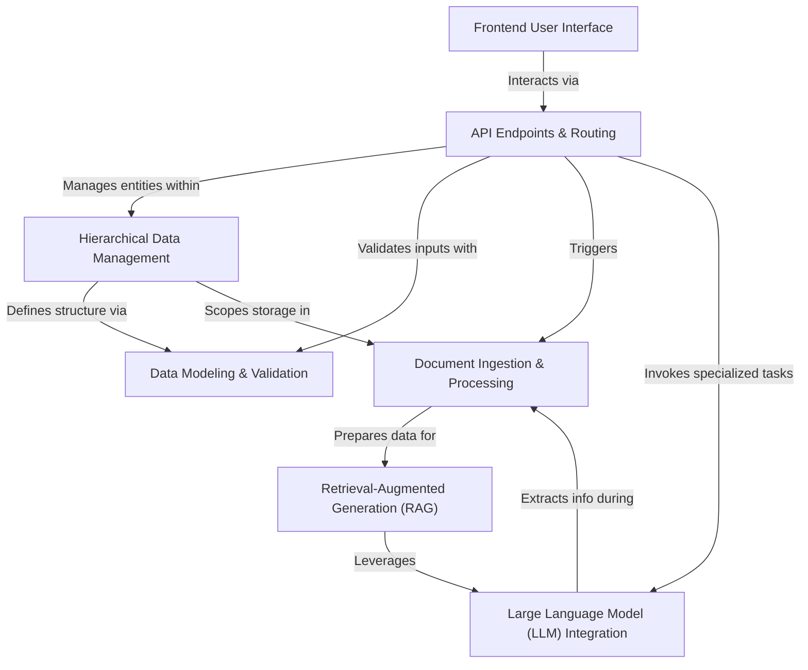

# Tutorial: Docu-AI-Navigator

Docu-AI-Navigator is an **AI-driven platform** that helps companies, teams, and projects *securely manage and interact with their documents*. It allows users to **upload PDFs**, which are then processed by AI to enable intelligent features like *asking questions and getting factual answers* (RAG) and *generating detailed project plans* based on their stored information.

## Visual Overview

## Chapters

1. [Frontend User Interface
](01_frontend_user_interface_.md)
2. [API Endpoints & Routing
](02_api_endpoints___routing_.md)
3. [Data Modeling & Validation
](03_data_modeling___validation_.md)
4. [Hierarchical Data Management
](04_hierarchical_data_management_.md)
5. [Large Language Model (LLM) Integration
](05_large_language_model__llm__integration_.md)
6. [Document Ingestion & Processing
](06_document_ingestion___processing_.md)
7. [Retrieval-Augmented Generation (RAG)
](07_retrieval_augmented_generation__rag__.md)
